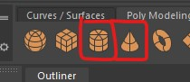
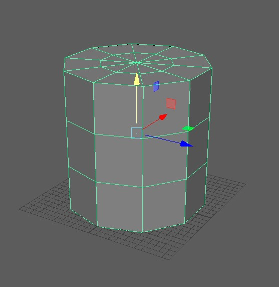

# Worksheet 1 - Navigation and Creating Polygons

### Before you start

All the machines in the lab have Maya installed, if you want you use your own machine follow the installation guide.

	https://www.uwe.ac.uk/study/it-services/software/specialist-software#autodesk_maya

Make sure you have a mouse.

## 1. Getting to know Maya

### Create a new scene

- Open up Maya
- Create a new Scene

	

### Add a polygon

- Create a polygon cube

	

This will create a new polygon cube in the middle of your scene.

	
 
### Navigate around the scene
 
##### On Windows 
 
 - The **Mouse wheel** zooms in and out.
 
 	
 
 - Hold down **alt or cmd** and **left mouse button** to orbit.
 
 	
 	
 - Hold **alt or cmd** and **press the scroll wheel** to pan.
 
	
 

### Manipulate the cube

#### Move
- Click on the cube to select it.
- Click on the move button on the left side of the screen, or press **w** on the keyboard.

	
	
- Click and drag on the arrows to move the cube in the x, y or z direction. 

	

You should generally stick to the 3 coloured arrow never use the middle yellow square as this will move the cube relative to the camera.

#### Rotate
- Click on the rotate button, or press **e** on the keyboard 

	
	
- Use the red, green and blue rings to rotate the cube in x, y and z planes.

	

Never use the outer light blue ring as this will rotate the object relative to the camera.

#### Scale
- Click on the scale button, or press **r** on the keyboard

	
	
- Use the centre square to evenly scale the cube.

	
	
Use the red, green and blue squares to scale the cube in the x, y and z directions only.

### More shapes

- Create a **cylinder** and a **cone**

	

By default the shapes have a low polygon count, you can see this clearly on the cylinder which doesn't look very round. You may want this in your project but we need a rounder shape.

	
	
- Delete the cylinder shape by selecting it and pressing **delete** on the keyboard.
	
- Double click on the create cylinder button, this opens up the cylinder options.

	

	
	
- Increase the axis divisions to 20 and make sure the rest of the numbers match mine.

- Press **Create** to add the cylinder to the scene.

### Outliner
- At the bottom of the left panel click the outliner button

	

- This will open the outliner panel which which shows all the object in your scene.

	

- Double click pCylinder and rename it to "body"
- Double click pCone and rename it to "nose cone"
- Rename or delete the other shapes as you want.

### Saving
When using Maya save regularly to avoid loosing work.
- Choose **File > Save scene As.." 
- Create a folder on your network drive called "principles_of_3D"  
- Save the scene "worksheet_1_rocket" and save it.

### Grouping
- Hold down **shift** and **click the body and nose cone in the outliner.
- Press **ctrl + G** to create a group.
- **Double click** the group and rename it "rocket".

	

You can use the outline to select items that may be hard to select in the scene.
- Position the nose cone and body appropriately in the scene, scale and rotate them as needed.

	

### Increment and save
- go to **File > Increment and save**

As you have already saved, you should now use Increment and save. This will create a new save file with a number at the end of the file name.

	

Increment and save it very helpful as it allows you to go back to previous versions of your model.

### Centring
It is important that your centre your final object so that it appears where expected when imported into other programs.

The centre of your scene is called the origin, and is in the middle of the gird.

	

- To centre your group, first reset the pivot by selecting the group in the outliner and selecting **Modify > centre pivot**

	
	
- Then move your object so that it is in the middle of the grid.

## **Final Challenge** - Finish your rocket

Your Maya skills will improve the more you practice, for this challenge practice the skill you have learnt so far.
- Use cubes, cylinders and cones, and experiment with other primitive shapes to create a simple retro rocket.
- Name all the parts in the outliner.
- Group them all appropriately.
- You should be regularly moving the camera around your object to check it looks good from all angles.
- Get in the habit of saving regularly.

	

## Tips

- To centre the camera on your object, select it in the hierarchy and press **f** - If you want to temporarily hide any of your objects, select it and press **h**, to un-hide it, find select it in the hierarchy and press **h** again.

