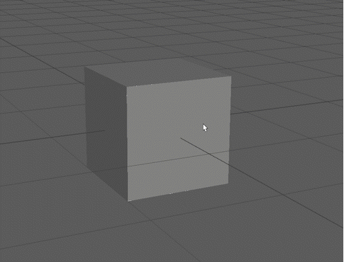
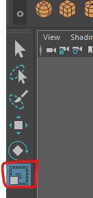
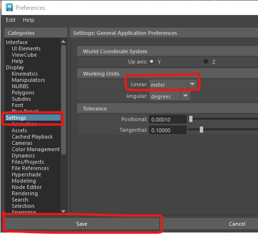
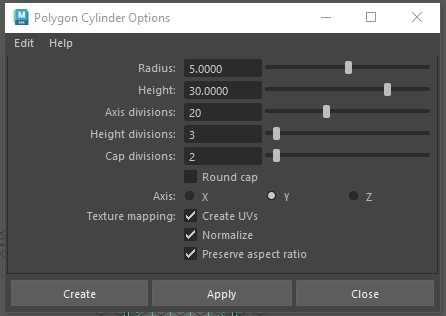
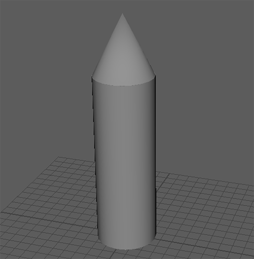
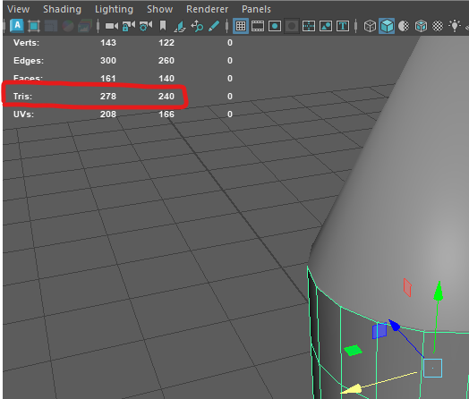
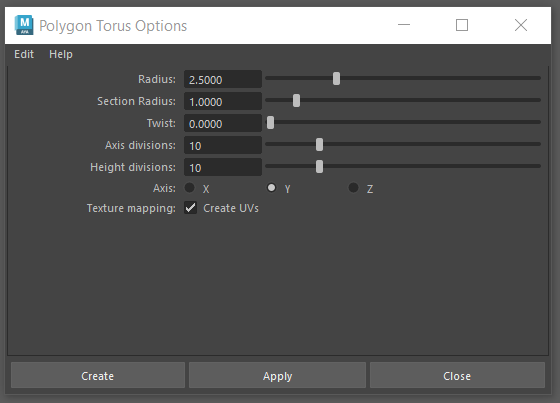
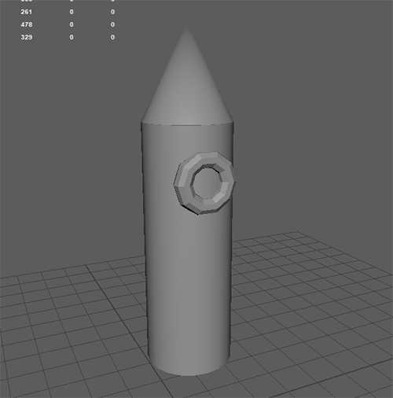
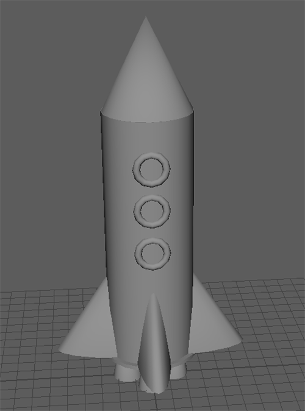

# Worksheet 1 - Navigation and creating polygons

### Before you start

All the machines in the lab have Maya 2025 installed, if you want you use your own machine follow the installation guide

[Maya Installaton Guide](https://www.uwe.ac.uk/study/it-services/software/specialist-software#autodesk_maya)

It is essential that you have a mouse.

The screen shots in this worksheet are from the PC version of Maya, if you are using a Mac they may look slightly different but the functionality will be the same.

## 1. Getting to know Maya

### Create a new scene

- Open up Maya
- Create a new Scene

### Add a polygon

- **DOUBLE CLICK** on the create a polygon cube button.

This will open up the **polygon cube options** panel.

Here you can change the properties of the cube.

The Width, Height and Depth are the dimensions of the cube.

The divisions split the cube sides into multiple faces.

- Edit the numbers to make a 1 x 1 cube with 2 divisions on each side.

This will create a new polygon cube in middle of your scene.

 
### Navigate around the scene

- Hover your mouse cursor over your cube.

#### Zoom
- The **Mouse wheel** zooms in and out.
 

 
 #### Orbit 
 - Hold down **alt** and **left mouse button** then move your mouse to orbit.
 

#### Pan
 - Hold **alt** and **press the scroll wheel** and move your mouse to pan.

We **highly recomend** you use a mouse when working with any 3D program, however, if you are only able to use a laptop track pad you can find other navigation tools such as the **Track Tool** in the **View > Camera Tools** menu.

#### Select tool

The **Select tool** lets you select objects in your scene.

- **Click** on the arrow at the top of the toolbox on the left of the screen to make sure the **Select tool** is chosen. The keyboard shortcut is "q".

 

You will use many tools during these worksheets, remember that you can quit out of those tools and go back to the **Select tool** by pressing "q".
 

#### Move

- Press **f** to centre the selected object on the screen.
- Click on the move button on the left side of the screen *the keyboard shortcut is w*.

	
- Click and drag on the arrows to move the cube in the x, y or z direction. 

**Avoid** using the central square as this will move the cube relative to the camera making it very hard to position accurately in the current perspective view.

#### Rotate
- With the cube still selected click on the rotate button (shortcut **e**)

	
- Use the red, green and blue rings to rotate the cube in x, y and z planes.

Avoid use the outer light blue ring as this will rotate the object relative to the camera.

#### Scaling
- **Click** on the scale button (shortcut **r**)

	
- Use the centre square to evenly scale the cube.

	
- Use the red, green and blue squares to scale the cube in the x, y and z directions only.

## 2. Make a Rocket

### Units

By default the units in Maya are set to centimetres. 

This means if I create a cube 1 unit hight it is 1cm high.

If you are building a larger object you may need to change your units

- Go to **Windows > Settings > Preferences**

- Select **Settings**

Here you can change the Linear Working units to **meter**.

### Add a cylinder

- **Double click** on the **create cylinder button** to open the options panel.

- Change the radius to 5 and the height to 30
- Increase the axis divisions to 20

- Press **Create** to add the cylinder to the scene.

- Do you remember how to move objects? Move the cylinder up above the grid.

### Add a cone.

- Add a cone by **double clicking** on the **create cone button**.

- Choose values you think are appropriate for the options.

- Press Create.

- If you are unhappy with your choices you can select the cone and press **delete** to remove it and try again.

### Outliner

The Outliner is on the left of your screen, it shows all the object in your scene.

You can show and hide it by using the button in the left panel 

- **Click** the **outliner button** to try this out.

- **Double click** pCylinder and rename it to "body"
- **Double click** pCone and rename it to "nose cone"

### Saving
When using Maya save regularly to avoid losing work.
- Choose **File > Save scene As..**
- Name the scene 'worksheet_1_rocket' and save it.

### Grouping
- Hold down **shift** and **click** the body and nose cone in the outliner to select them both.
- Press **ctrl** and  **G** to create a group containing the selected objects.
- **Double click** the group and rename it 'rocket'.

### Select using the outliner

You can use the outline to select items that may be hard to select in the scene.

- Select pCube1 in the outliner and press delete to remove it.

- Position the nose cone and body appropriately in the scene, scale and rotate them as needed. 

- 
### Increment and save
- Go to **File > Increment and save**

As you have already saved, you should now use Increment and save. This will create a new save file with a number at the end of the file name.

Increment and save is very helpful as it gives you multiple copies of your file allowing you to go back to previous versions if you make a mistake.

### Centring
It is important that your centre your final object so that it appears where expected when imported into other programs.

The centre of your scene is called the origin, and is in the middle of the gird.

Your rocket may already be in the centre of the scene, but if it is not you need to do the following.

- First reset the pivot by selecting the group in the outliner. Then selecting **Modify > centre pivot**

	
- Then move your object so that it is in the middle of the grid.

### Poly Count
When creating 3D assets it is important that you are are aware of the polygon or triangle count. For the assignments this year we will give you a maximum that you need to stay below.

- To show the count on your screen select **Display > Heads up display > Poly Count**

A box will now appear in your scene, the 2 numbers next to **tris** are the total number of triangles in your scene and the number in the currently selected object/s

### Create a window

- **Double click** the **create torus button** to open the options and make sure yours match mine.

- Press **Create**

- Position the torus on the front of the rocket. TIP : hold down **j** before rotating to lock the rotation to 15 degree increments.

### Duplicate is better than copy and paste

- We want 3 windows, to copy the first one, select it and press **ctrl** and **d**.

It is important that you don't use **ctrl** and **c** as you normally would in other packages as this creates unwanted extra grouping in Maya.

- Move the new windows down to form a neat row on the rocket.
 

### Organise the new windows.

- Rename the new windows in the outliner.

- In the outliner you can now **middle mouse click** and drag the window into the rocket group

## 4. Challenge - Finish your rocket

Your Maya skills will improve the more you practice, for this challenge practice the skill you have learnt so far.
- Use cubes, cylinders and cones, and experiment with other primitive shapes to create a simple retro rocket.
- Name all the parts in the outliner.
- Group them all appropriately.
- You should be regularly moving the camera around your object to check it looks good from all angles.
- Increment and Save regularly.
- Keep the total triangle count to under 3000.  Carefully considering the number of divisions you use when creating new polygons, especially a torus.

This is my example, try to replicate this or make something yourself.

This week we have just used primitive shapes to create our model, Next week we will dive into the components which make up these shapes and model more complex objects.

