# Worksheet 2 - Faces, Edges and vertexes

### Before you start

All the machines in the lab have Maya installed, if you want you use your own machine follow the installation guide.

[Maya Installaton Guide](https://www.uwe.ac.uk/study/it-services/software/specialist-software#autodesk_maya)

It is essential that you have a mouse.

### Create a new scene

- Open Maya and create a new scene.

### Create a Cube
- **Double click** on the create Cube button to open the cube options window

- Change the values as show below

- Press **Apply**

### Faces, Edges and Vertices
In the last worksheet we manipulating whole objects. However, each polygon is made of different components that we can manipulate individually to give us more control.

They are **faces**, **Edges** and **Vertices**

### Modeling toolkit
- Open the **modeling toolkit** by press the button on the top right of the screen

- Select the **faces** button

- **Click** on an individual face on the cube to select it ( you can also **hold shift** to select multiple faces)
- Use the move (shortcut w), scale(e) and rotate(r) tools found on the left of the screen to practice manipulating the face just as you did with the whole polygon.

	
You can undo at an point by pressing **ctrl or command** and **z**.

Try to do the same thing with the edge and vertex selection modes

- Try to move, scale and rotate individual or groups of edges and vertices.

	
- Select the button on the left to go back to selecting the whole polygons.

### Alternative

Another way to access the vertecies, edges and faces is to **hold down** the **Right mouse button** over the polygon and then **let go** over the option you want.

To to back to selecting the whole object 
	
- Delete your polygon by selecting it in the scene or in the outliner and pressing delete.

## Box modeling

For the rest of this worksheet we will create a very simple character using the box modeling technique, starting with a simple shape we will extrude out details.

We will create one side, and then mirror it.

### Create a cube

- First create a new cube by single clicking on the new cube button.

 

It will create a cube with the same parameters as the one you created earlier.

	
- Move the cube up so that it sits above the grid, we can think of the grid as the floor.

### Extrude a leg

- Select the face on the bottom right of the cube.

- In the modeling toolkit press the extrude button.

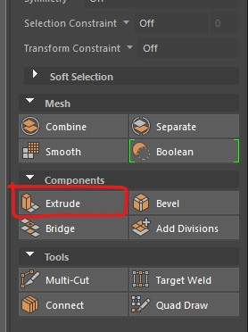
	
- Click and drag down on the blue arrow to pull a leg shape out of the cube

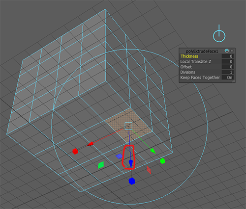

- Press **q** to quit out of the extrude tool when you have finished.

- To learn more about extrusion see the extra videos section in learning materials on Blackboard.

### Add a foot

Next we are going to add some more edges so that we can create a foot.

### Multi-cut

- In the Modeling toolkit select **Multi-cut**

You can use this tool to add individual edges, but we are going to add a complete edge loop.

- Hold down the **ctrl or command** key and move your mouse over the leg of your character.

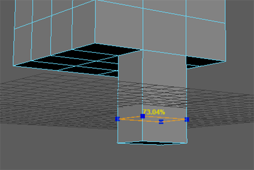

- **Left click** to add an new edge loop.
- Press **q** to quit out of the tool.

We can now extrude the foot from the leg.

- Go into face selection mode.

- Select the face at the bottom of the leg and extrude it out as we did before.

- Remember to press **q** when you have finished to stop extruding.

### Arm

- Now extrude an arm in the same way.

### Views

We are currently looking through the perspective camera which gives us a 3D view of the character, but we can also use the orthographic views to make selecting multiple components easier.

- Open up the 4 panel layout by pressing the button on the bottom left of the screen.

	
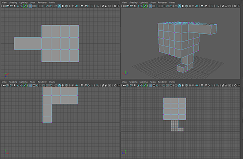

### Move vertices

We can now manipulate some of the  vertices and edges to improve the shape.
- Go in vertex selection mode.

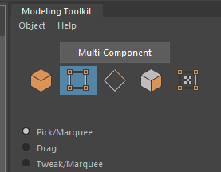
	
- Draw a square around the front of the character to select all the front vertices.

- Move them backwards to create a better shape for the torso.

- Do the same thing for the back of the character.

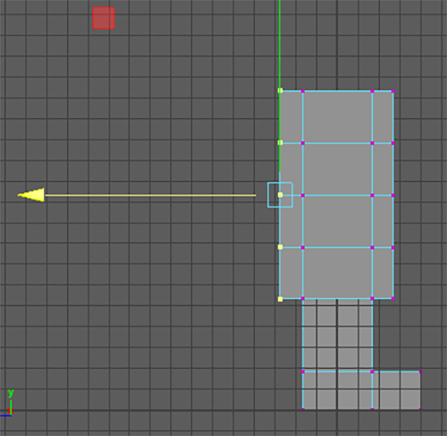

- You can now go back into the perspective view by pressing the button on the left.

### More improvements

We can manipulate the shape further by moving some of the edges.
- Go into edge mode.

- Select the top of the foot and move it down.

	
We can clearly spend a lot of time adding more edges and manipulating them to get an increasingly complex shape but for this tutorial we will stop here.

### Mirroring

Now that we have finished one half of our character we will mirror it.

First we are going to delete half our model.

- Go in to the 4 panel layout.

	
- Go in Face selection mode.

- Draw a rectangle around half of your model ( the half without an arm or leg) using the front view. 

- Press Delete

You should now have half a character

- Go back into perspective view.

- Go into object selection mode and select your model.

	
- To mirror, go to **Mesh** in the top menu and select the small square next to mirror. This is the mirror options.

- Make sure your options match mine.

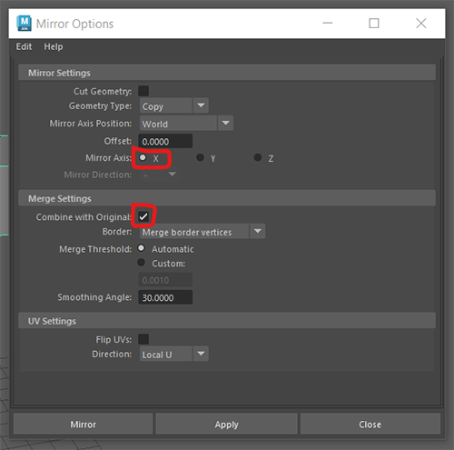
	
- Press Apply

You should now have a complete character body.

### Make a head

Next we want to add a head.

We could extrude the neck and head out from the torso just as we did the legs and arms, however, in we want to add a circular head that we can manipulate separately from the body.

- Double click on the create cylinder button to open the options

- Set the properties to be the same as mine. make sure you tick **round cap**

- Positions the new shape on top of the character

### Soften edges

Edges in Maya can be **soft** or **hard**. soft edges are good for rounded shapes, and hard edges are good for corners.

Most polygons will have a combination of the two.

The head of our character has some hard edges we do not want.

We want to soften all the edges on the head so first select the entire head. You can select individual edges if you need to.

Then go to **Mesh Display > Soften Edge**

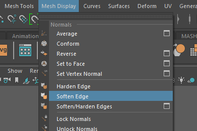

Your head should now look like this

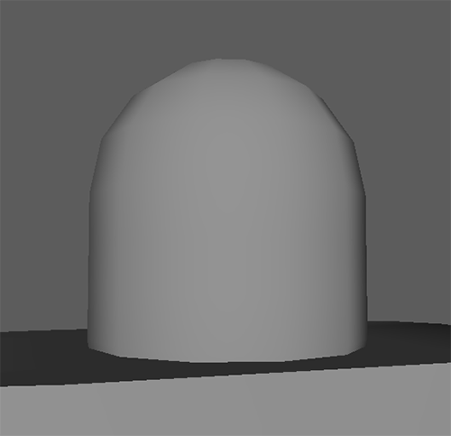

### Delete edges

Deleting unneeded faces and edges is the easiest way to reduce you triangle count.

Our head currently has more triangles than it needs. 

we cannot delete the edges on the top as this will effect the overall shape, but we can delete some of the edges from the middle.

- Hold down shift and double click the edges going round the middle of the head

- Press **ctrl** and **delete or backspace**

If you only press **delete or backspace** Maya will leave behind the vertices, which wont reduce your triangle count.

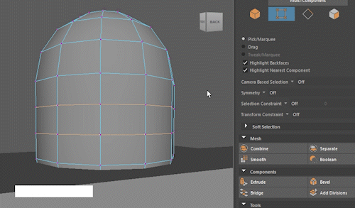

## Delete unwanted faces

Another way to reduce you triangle count is to delete hidden faces.

I would recomend you do not do this until the very end. but we can do it on our character now.

- Hide the body by selecting it in the outliner and pressing **h**

- Select the faces on the bottom of the head

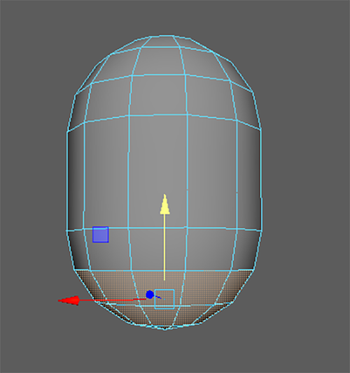

- Press delete

- Select the body in the outliner again and press **h** to show it.

## Challenge - finish the character

If you want more practice, try to add some more detail to the character.

- Add more shapes such as eyes and a hat.
- Use multi-cut and extrude to add more detail.
- Move the edges to create a more interesting shape.

	
## Tips

- Double click on an edge to select the whole edge loop.
- When extruding, you can use the scale control to extrude along the surface.

