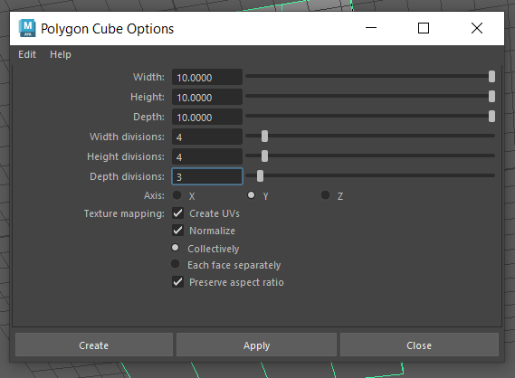
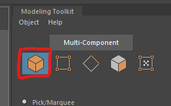
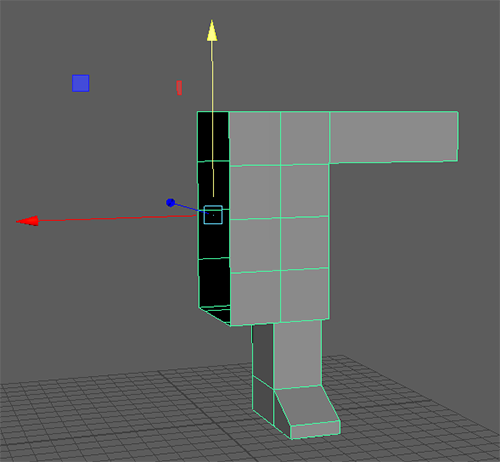
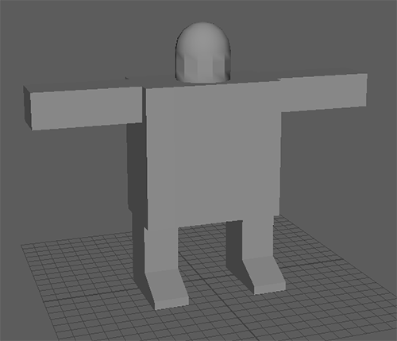
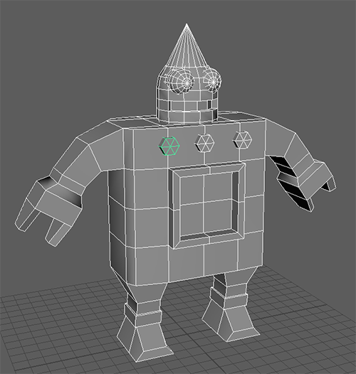

# Worksheet 2 - Faces, Edges and vertexes

### Before you start

- All the machines in the lab have Maya installed, if you want you use your own machine follow the installation guide.
- Make sure you have a mouse, you can use Maya with a track pad but it is much harder.

### Create a new scene
- Select **File > New Scene**

### Create a Cube
- Double click on the create Cube button to open the cube options window
- This allows you to choose specific details when you create a new polygon
- Change the values as show bellow

	

- Press **Apply**

### Faces, Edges and Vertices
- So far we have been manipulating whole objects. However, each polygon is made of different components that we can manipulate individually to give us more control
- The are **faces**, **Edges** and **Vertices**

### Modeling toolkit
- Open the **modeling toolkit** by press the button on the top right of the screen

	

- Select the **faces** button

	

- Click on an individual face on the cube to select it ( you can also hold shift to select multiple faces)
- Use the move (shortcut w), scale(e) and rotate(r) tools to practice manipulating the face just as you did with the whole polygon.

	
	
- You can undo at an point by pressing **ctrl or cmd** and **z**.

- Try to do the same thing with the edge and vertex selection modes, try to move, scale and rotate individual or groups of edges and vertecies.

	
	
- To go back to selecting the whole polygons,select the button next button on the left.

	
	
- Delete your polygon by selecting it in the scene or in the outliner and pressing delete.

## Box modeling

- For the rest of this worksheet we will create a very simple character using the box modeling technique, starting with a simple shape we will extrude out details.

- Will create one side, and then mirror it.

- First create a new cube by clicking on the new cube button.

	
	
- Move the cube up so that it sits above the grid, we can think of the grid as the floor.

### Extrude a leg

- Select the face on the bottom of the cube

	

	

- In the modeling toolkit press the extrude button.

	
	
- Click and drag down on the blue arrow to pull a leg shape out of the cube

	

	

- Press **q** to quit out of the extude tool

### Add a foot

- Next we are going to add some more edges so that we can create a foot..

### Multi-cut

- In the Modeling toolkit select **Multi-cut**

	

- You can use this tool to add individual edges, but we are going to add a complete edge loop.

- Hold down the **ctrl or cmd** key and move your mouse over the leg of your character.

	

- **Left click** to add an new edge loop.
- Press **q** to quit out of the tool.

- We can now extrude the foot from the leg.

- Go into face selection mode.

	

- Select the face at the bottom of the leg and extrude it out as we did before.

- Remember to press **q** when you have finished to stop extruding.

	

### Arm

- Now extrude an arm in the same way.

	

### Views

- We are currently looking through the perspective camera which gives us a 3D view of the character, but we can also uwe the orthographic views to make selecting multiple components easier.

- Open up the 4 panel layout by pressing the button on the bottom left of the screen.

	
	
	

### Improve the shape 1

- We can now manipulate some of the  vertecies and edges to improve the shape.
- Go in vertex selection mode.

	
	
- Draw a square around the front of the character to select all the front vertecies.

	

- Move them to create a better shape for the torso.

	

- Do the same thing for the back of the character.

	

- You can now go back into the perspective view by pressing the button on the left.

	

### More improvements

- We can manipulate the shape further by moving some of the edges.
- Go into edge mode.

	

- Select the top of the foot and move it down.

	
	
- We can clearly spend a lot of time adding more edges and manipulating them to get an increasingly complex shape but for this tutorial we will stop here.

### Mirroring

- Now that we have finished one half of our character we will mirror it.

- It will make it much easier to model if our Character is centred on the grid, helpfully as we have not moved our origin cube it will be.

- First we are going to delete half our model.

- Go in to the 4 panel layout.

	
	
- Go in Face selection mode.

	

- Draw a rectangle around half of your model using the bottom left view.

	

- Press Delete

- You should now have half a character, go back into perspective view.

	

- Go into object selection mode and select your model.

	

	
	
- To mirror, go to **Mesh** in the top menu and select the small square next to mirror.

	

- Make sure your options match mine.

	
	
- Press Apply
- You should now have a complete character body.

### Make a head

- Lastly we want to add a head
- We could extrude the neck and head out from the torso just as we did the legs and arms, however, in we want to add a circular head, it make sense to add it as a separate object.

- Double click on the create cylinder button to open the options

	

- Set the properties to be the same as mine. make sure you tick **round cap**

	

- Positions the new shape on top of the character

	
	
## Challenge - finish the character

- If you want more practice, try to add features to the head. 
- Use multi-cut to add more edge loops to the legs and arms.
- Move the edges to create a more interesting shape.
- Extrude out some more faces to add features to your character.

	