# Worksheet 2 - Faces, Edges and Vertices 

### Before you start

All the machines in the lab have Maya installed, if you need Maya on your own machine follow this installation guide.

[Maya Installaton Guide](https://www.uwe.ac.uk/study/it-services/software/specialist-software#autodesk_maya)

It is essential that you have a mouse.

If you get stuck or have any questions please ask for help.

### Create a new scene

- Open Maya and create a new scene.

### Create a Cube
- **Double click** on the **create Cube** button to open the cube options window.

- Change the values as show below.

- Press **Apply**.

### Faces, Edges and Vertices
In the last worksheet we manipulating whole objects. However, each polygon is made of different components that we can manipulate individually to give us more control.

These are the **Faces**, **Edges** and **Vertices**.

### Modeling toolkit
- Open the **modeling toolkit** by pressing the button at the top right of the screen.

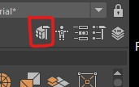

#### Faces

- Select the **faces** button.

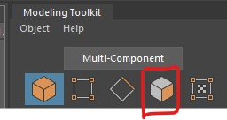

- **Left Click** on an individual face on the cube to select it. 
- **hold shift** and **Left Click** to select multiple faces.
- **hold tab** and **Left Click** and move the mouse to paint a selection.
- **hold Ctrl** and **Left Click** to de-select faces.
- Use the move (shortcut w), scale(e) and rotate(r) tools found on the left of the screen to practice manipulating the face just as you did with the whole polygon.

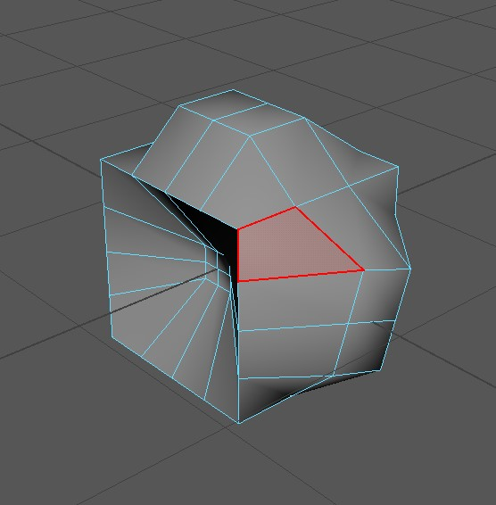

#### Vertices

Now try to do the same thing with the **vertices**.

- Select an individual Vertex or a group of vertices
- move(w), scale(e) and rotate(r) the vertices.

#### Edges

Lastly, switch to edge selection.

	
- Select an individual or group of edges.
- Move (w), scale(e) and rotate(r) the edges.
- One very useful feature of edges are **Edge loops**, double click on an edge to select the entire loop.

#### Whole object

You can go back to selecting the whole object by clicking on the left button.

### Alternative

Another way to access the vertices, edges and faces is to **hold down** the **Right mouse button** over the object and then **let go** over the option you want.

- Delete your object by selecting it in the scene or in the outliner and pressing delete on the keyboard.

## Box modeling

For the rest of this worksheet we will create a very simple character using the box modeling technique, starting with a simple shape we will extrude out details.

This technique has many benefits over just combining primitive objects as we did in the last worksheet. With practice it is fast and allows you to create complex, clean models.

We will create one side of a character, and then mirror it.

### Create a cube

- First create a new cube by **left clicking** on the new cube button.

 

It will create a cube with the same parameters as the one you created earlier.

	
- Move the cube up so that it sits above the grid, we can think of the grid as the floor.

### Extrude a leg

- Select the face on the bottom right of the cube.

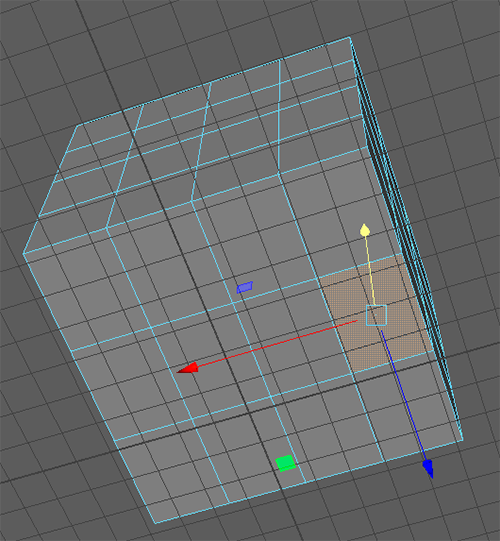

- In the modeling toolkit press the smart extrude button.

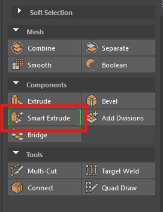

WARNING!: Even though you can't see it your face will have extruded with a depth of 0 as soon as you press this button, if you change your mind, undo to remove this hidden extrusion.

- Click and drag down on the blue arrow to pull a leg shape out of the cube.

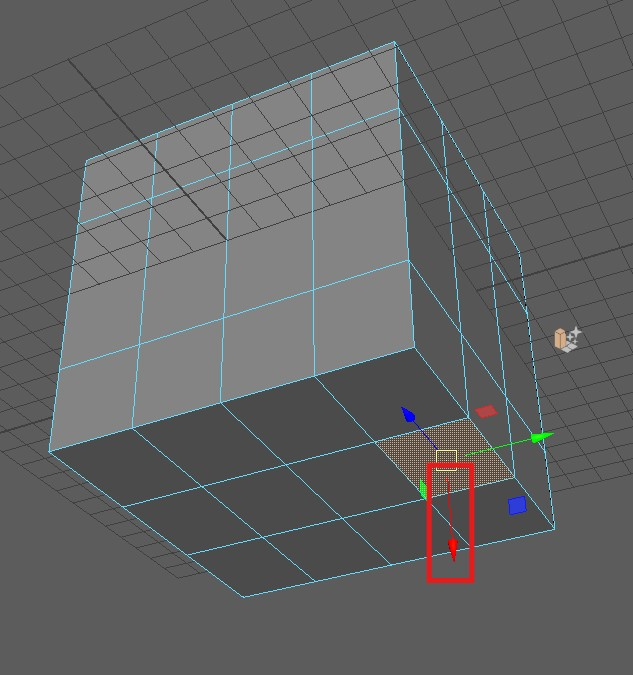

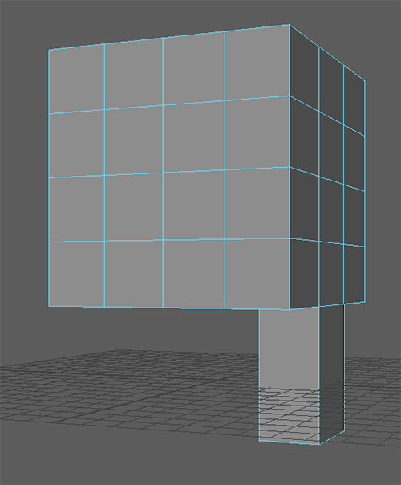

- Press **q** to quit out of the extrude tool when you have finished.

- To learn more about selecting, extrusion and other useful tools  see the extra videos section in learning materials on Blackboard (Learning materials > Workshops > Extra videos)

### Add a foot

Next we are going to add some more edges so that we can create a foot.

### Multi-cut

- In the **Modeling toolkit** select **Multi-cut** (shortcut: control + shift + x)

You can use this tool to add individual edges, but we are going to add a complete edge loop.

- Hold down the **ctrl** key and move your mouse over the leg of your character.

- **Left click** to add an new edge loop.
- Press **q** to quit out of the tool.

We can now extrude the foot from the leg.

- Go into face selection mode.

- Select the face at the bottom of the leg and extrude it out as we did before.

- Remember to press **q** when you have finished to stop extruding.

### Arm

- Now extrude an arm in the same way.

### Views

We are currently looking through the perspective camera which gives us a 3D view of the character, but we can also use the orthographic views to make selecting multiple components easier.

- Open up the 4 panel layout by pressing the button on the bottom left of the screen (or tap the space bar)

	
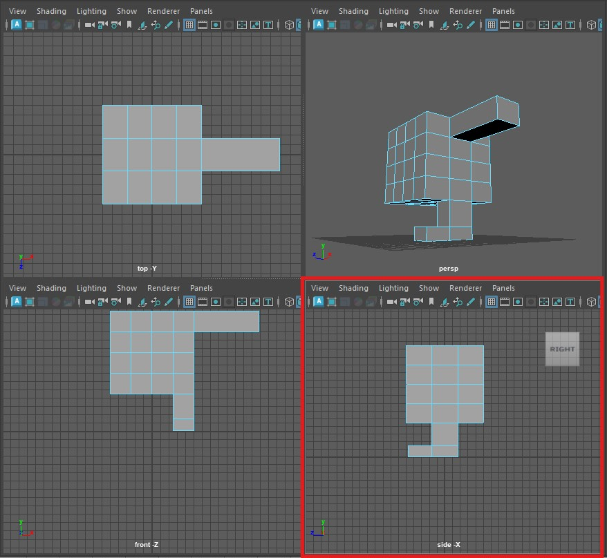

- Now move into the **side-x** panel by hovering the mouse over that view and **tapping** the **space bar**.

### Move vertices

We can now manipulate some of the  vertices and edges to improve the shape.
- Go in vertex selection mode.

	
- Draw a square around the front of the character to select all the front vertices.

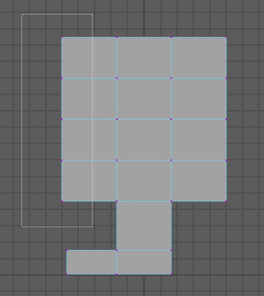

- Move them backwards to create a better shape for the torso.

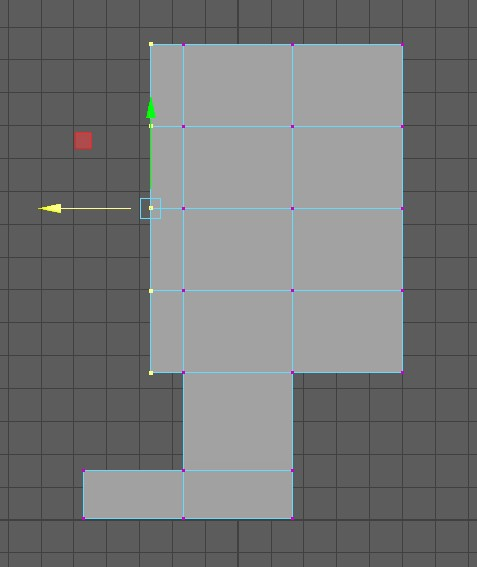

- Do the same thing for the back of the character.

- You can now go back into the perspective view by pressing the button on the left. ( or tapping the space bar and again over the persp panel)

### More improvements

We can manipulate the shape further by moving some of the edges.
- Go into edge mode.

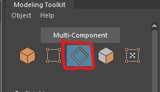

- Select the top of the foot and move it down.

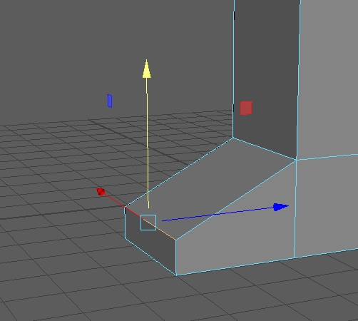
	
We can clearly spend a lot of time adding more edges and manipulating them to get an increasingly complex shape but for this tutorial we will stop here.

### Mirroring

Now that we have finished one half of our character we will mirror it.

First we are going to delete half our model.

- Go into the front view.
- Enable Face selection mode.

- Draw a rectangle around half of your model ( the half without an arm or leg) using the front view. 

- Press Delete

You should now have half a character

Note the small indicator in the bottom left of the panel. In the next step we will mirror in the x direction.

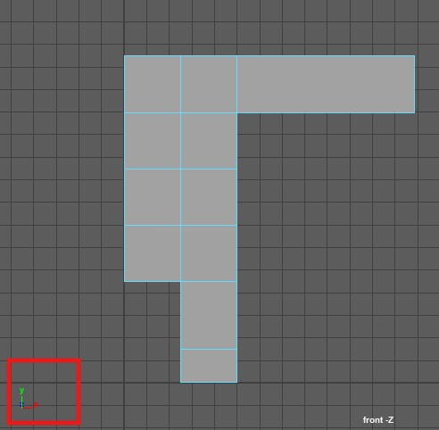

- Go back into perspective view.

- Go into object selection mode and select your model.

	
- To mirror, go to **Mesh** in the top menu and select the small square next to mirror. This is the mirror options.

We created our character in the centre of the grid at the origin so we can use the **World** mirror axis position.

Earlier, the corner indicator showed that I needed to mirror in the x direction.

We want to combine the mirrored object with the original so we finish with one combined shape.

- Set your options the same as mine

	
- Press Apply

You should now have a complete character body. 

#### Trouble shooting

If your mirroring has not worked, press undo and try to mirror again.
	
- Did you made your character on a different axis, try "z" instead.
-  Do you need to mirror left to right rather than right to left? Change to the mirror direction to +
- Is your character at the centre of the grid?

### Make a head

Next we want to add a head.

We could extrude the neck and head out from the torso just as we did the legs and arms, but, we want to add a circular head that we can move separately from the body.

- Double click on the create cylinder button to open the options

- Set the properties to be the same as mine. make sure you tick **round cap**

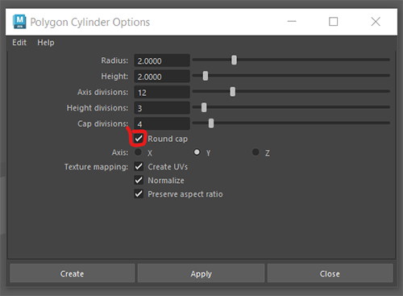

- Positions the new shape on top of the character

### Soften edges

Edges in Maya can be **soft** or **hard**. Soft edges are good for rounded shapes, and hard edges are good for sharp corners.

Most polygons will have a combination of the two.

The head of our character has some hard edges we do not want.

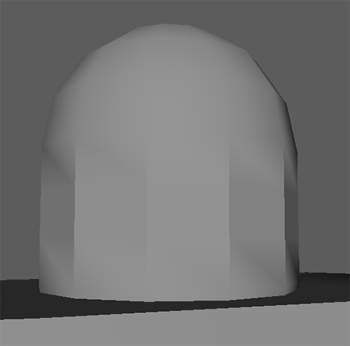

We want to soften all the edges on the head so first select the entire head. You can select individual edges if you need to.

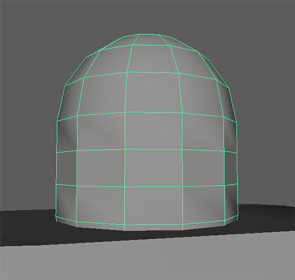

Then go to **Mesh Display > Soften Edge**

Your head should now look like this.

### Delete edges

Deleting unneeded faces and edges is the easiest way to reduce you triangle count.

- Display the poly count using the top menu (Display > Heads up display > poly count)

If you select the head you can see it has 240 triangles.

Our head currently has more triangles than it needs. 

we cannot delete the edges on the top as this will effect the overall shape, but we can delete some of the edges from the middle.

- Hold down shift and double click the edges going round the middle of the head

- Press **ctrl** and **delete or backspace**

**IMPORTANT** - If you only press **delete or backspace** Maya will leave behind the vertices, which wont reduce your triangle count.

The head should now have 192 triangles.

## Delete unwanted faces

Another way to reduce you triangle count is to delete hidden faces.

I would recomend you do not do this until the very end. but we can do it on our character now.

- Hide the body by selecting it in the outliner and pressing **h**

- Select the faces on the bottom of the head

- Press delete

- Select the body in the outliner again and press **h** to show it.

Without effecting how the head looks we have substantially reduced the number of triangles.

## Challenge - finish the character

To get more practice, try to add some more detail to the character.

- Add more shapes such as eyes and a hat.
- Use multi-cut and extrude to add more detail.
- Move the edges to create a more interesting shape.

	
## Tips

- Double click on an edge to select the whole edge loop.
- When using the standard extrude tool you can use the scale control to extrude along the surface.

