# Worksheet 2 - Faces, Edges and vertexes
#### 

### Before you start

- All the machines in the lab have Maya installed, if you want you use your own machine follow the installation guide.
- Make sure you have a mouse, you can use Maya with a track pad but it is much harder.

## 2. Create a low poly Trophy

### Create a new scene
- Select **File > New Scene" 

### Create a more detailed cylinder
- Double click on the create cylinder button to open the cylinder options window
- This allows you to choose specific details when you create a new polygon
- change the values as show bellow
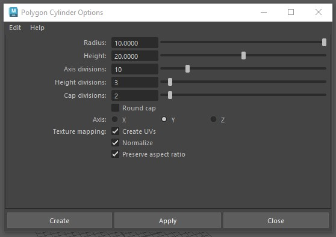

- Press **Apply**
- move the cylinder up so it is sitting on the grid

### Faces, Edges and Vertices
- So far we have been manipulating whole objects. However, each polygon is made of different components that we can manipulate individually to give us more control
- The are **faces**, **Edges** and **Vertices**

### Modeling toolkit
- Open the modeling toolkit by press the button on the top right of the screen

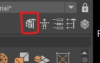

- Select the faces button

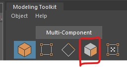

- Click on an individual face on the cyclinder to select it ( you can also hold shift to select multiple faces)
- use the move, scale and rotate tools to practice manipulating the face just as you did with the whole polygon

- try to do the same thing with the edge and vertex selection modes, try to move, scale and rotate individual or groups of eges and vertecies.

- To go back to selecting whole polygons,select the button next button on the left

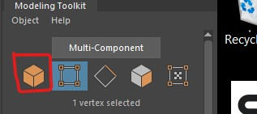
	
- Delete your polygon by selecting it in the scene or in the outliner and pressing delete.

### Edge loops

- Go in to edge selection mode

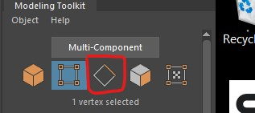
	
- Double click on one of the lower horizontal edges to select an entire edge loop.

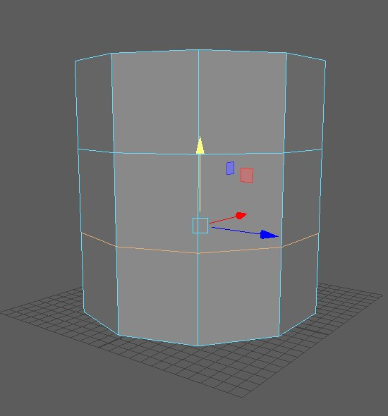

- Using and preserving edge loops in your models is very important for creating high quality models quickly.
- Scale the edge loop using the middle button to pinch the cylinder evenly.

- Select the upper edge loop and evenly scale that in to make a trophy shape

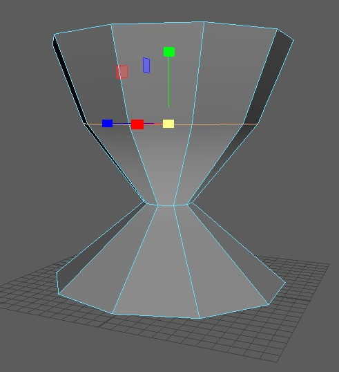

### Add edge loop - multi-cut tool

- The multi-cut tool allow you to add more edges to your object.
- In the modeling toolkit, select the multi-cut tool

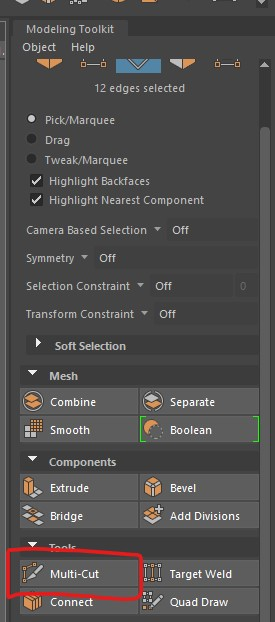
	
- Hold down the cnrl key and left mouse button and drag you mouse over your shape. when you relese the keys a new edge loop will be created. 

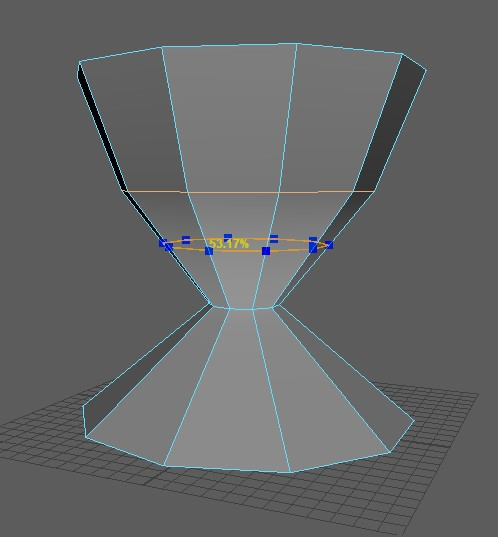

- Create three new edge loops to give your object more detail.
- You can quit out of any tool by pressing q on the keyboard, or pressing the arrow button in the top left

- Scale and move the new edge loops to create a rounder trophy.

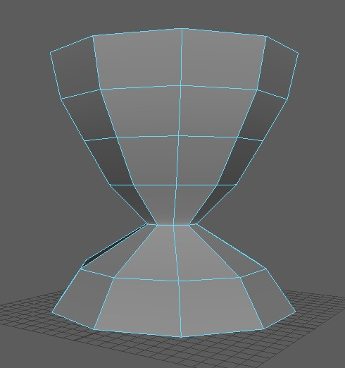

### Extrude faces - make a handle

- Press the face selection button in the modeling toolkit.

- Hold down shift and select two faces on the edge of the trophy, it is important that you select the faces that are in line with the z axis. The Thick grid line should be in line with the faces.

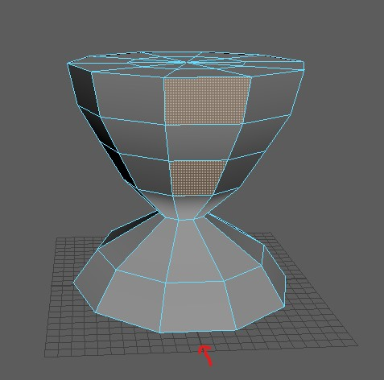

- Press the extrude button on the modeling toolkit

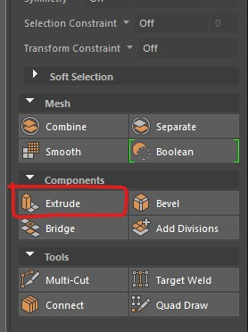
	
- Click and drag the blue arrow to extrude out the faces
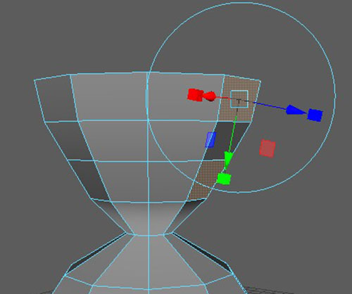

- Change the number of divisions to 3
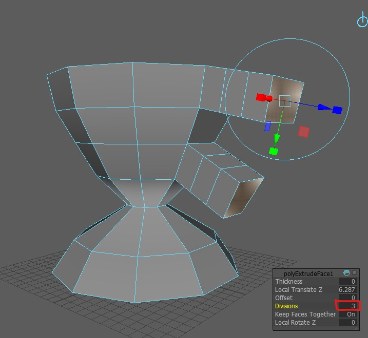

- Press q or press the arrow to quit out of the extrude tool

### Bridge the handle

- Select the 2 end inside faces on the handle

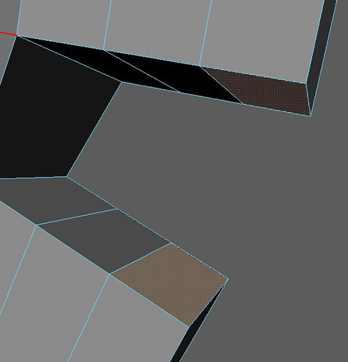

- Press the brige tool in the modeling toolkit

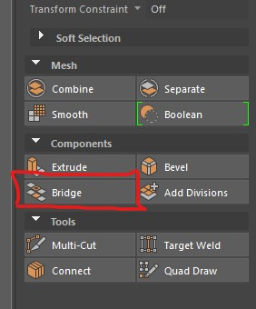

- Change the divisions to 2
- Press q to quit out of the tool

### Extrude in the top

- Enter face select mode by pressing the button in the toolkit

- Select one of the faces in the middle of the top of the trophy
- Then holding down tab on the keyboard and the left mouse button to paint selecting the rest.

- Scale up the selection using the scale tool

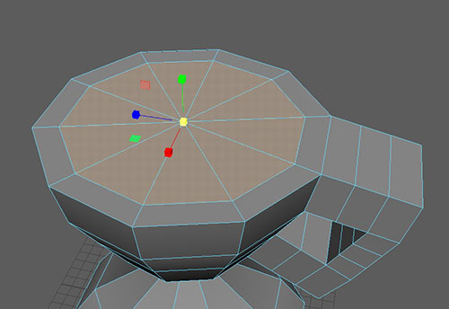

- Extrude the selection down

	

- Lastly, scale the selection down 

	

### Different views

- So far we have just been using the perspective, but we also have access to orthographic views.
- Hover you mouse over your object and tap the space bar.

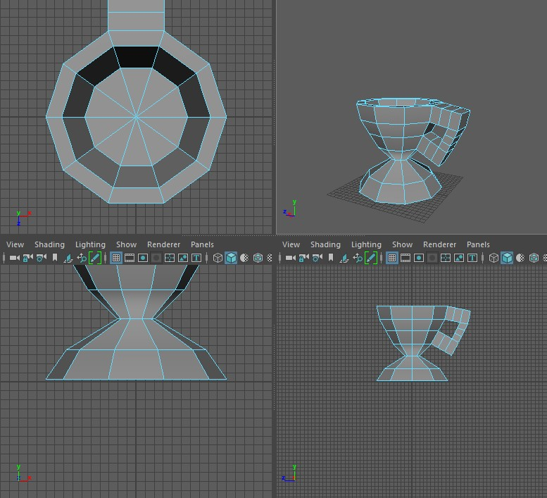
	
- Hover over the bottom right square and tap space again to maximise this view.

 
### Delete half

- We want the cup to have 2 handles, so lastly we will mirror the trophy.
- First we will delete the half we no longer want.
- You should still be in the side view.
- In face selection mode, click and drag to draw a box around the left half of the trophy, make sure you only select one half of the trophy
- Press Delete

### Mirror the trophy

- Lastly we can mirror the trophy. 
- Select the remaining half of the trophy

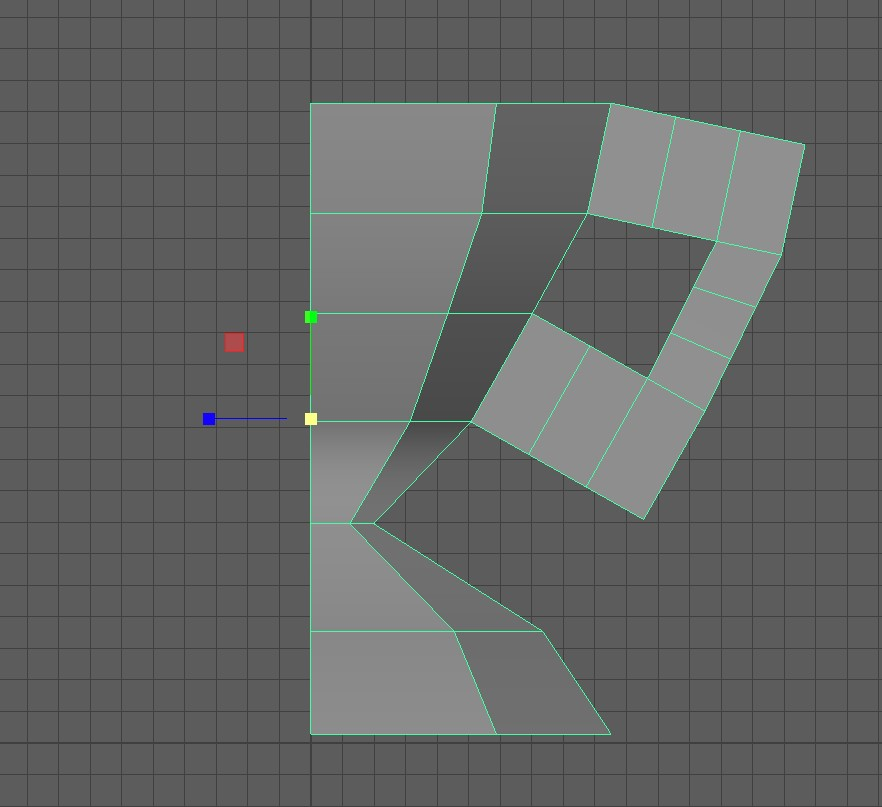

- Go to Mesh > Mirror and press the little square to the right, this is the options box.

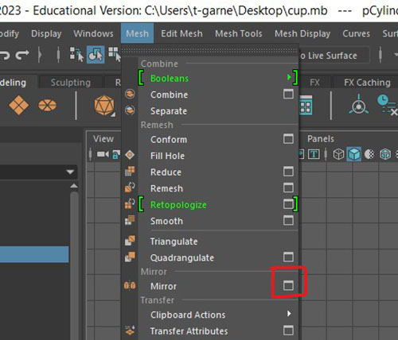

- Make sure you select the options bellow

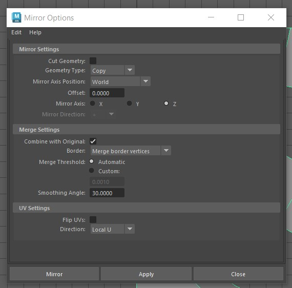

- The mirror axis is Z becase that is the direciton we want to mirror, In the bottom of the scene you can see the blue z axis indicator
- We want to combine with original and merge boarder vertices to end up with one solid object.
- Finally, when all the settings are correct press Mirror

### Look at finished Trophy

- Well done, you have now made a low poly trophy using many of the core box modeling tequniques
 
- Tap the space bar to view the tropy in the perspective view again. 

## Challenge - Finish the trophy

- Alter the trophy by moving edges and vertices
- Add more detail using the multi-cut tool
- Add a cube and scale and move it to form a base

