# Worksheet 5 - Organic modeling from a reference

### Before you start

All the machines in the lab have Maya installed, if you want you use your own machine follow the installation guide.

[Maya instalation guide](https://www.uwe.ac.uk/study/it-services/software/specialist-software#autodesk_maya)

Make sure you have a mouse.

### Create a new scene

- Open up Maya
- Create a new Scene

- Create a new folder and save the Maya scene inside it. 

This is important as we are now using multiple files and need to keep them together.

## Model a Pear

This worksheet will help you to model a pear, however, using an image reference is useful for many projects and rounded organic shapes are very common in many objects.

### Import reference image

Using an image reference is very useful as a guide to help you create a good model.

You can work from sketches for your own project, but we will work from a photo.

- Download the image of a pear and save it in the same folder as your scene.

[Pear image](./assets_for_worksheets/pear_reference.jpg)

### Create image plane

In Maya

- Select **Create > Free image plane**
- With the plane selected open up the attributes tab by pressing the button at the top right of the screen.

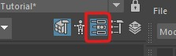

- Press the folder icon and navigate to your pear image.

- Move the pear image up so that it sits nicely on the grid ( press 'w' or the move button while the image is selected)

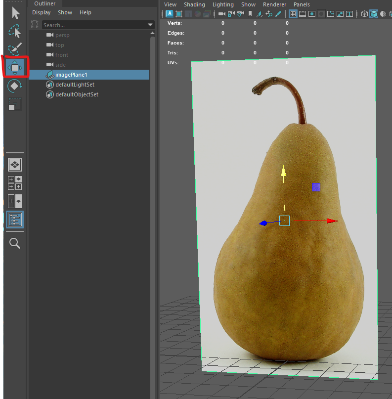

### Create a cylinder

- **Double click** on the **create cylinder button**

- Create a cylinder with the following properties

	- radius 5
	- height 10
	- Axis divisions 8
	- Height divisions 2
	- cap divisions 2

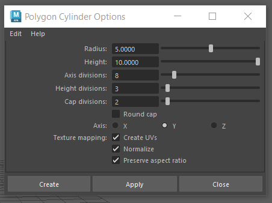

- Move the cylinder up so it is sitting on the grid.

### X-Ray mode

- Go into the side orthographic view by tapping the space bar, then hover over the front-z panel and tapping the space bar again.

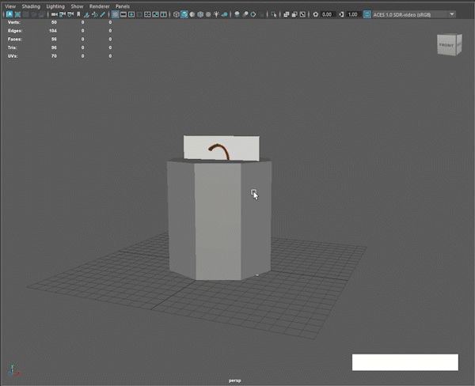

You can now enter X-Ray mode so you can see through your cylinder.

- Select **Shading > X-Ray** on the panel menu

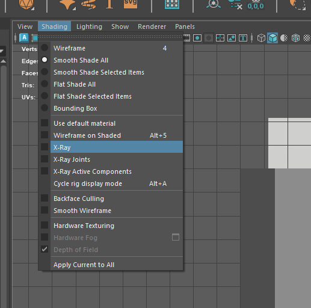

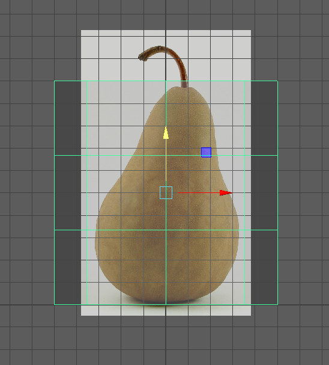

### Vertex mode

- Go into Vertex selection mode. You can do this through the Modeling toolkit.

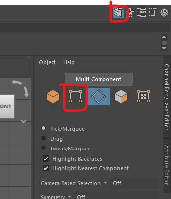

Or, if you want to work more quickly you can hold down the right mouse button, then move it and let go over the vertex button.

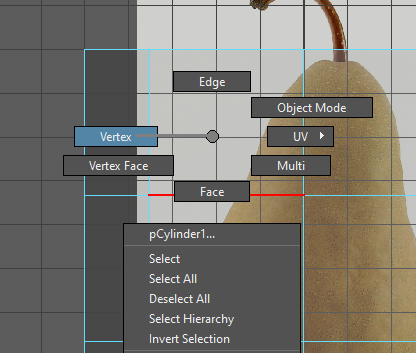

### Scale the edge loops

We can now scale down the vertices to match the shape of our pear reference.

- Select a whole row of vertexes by drawing a rectangle around them

- Go into scale mode by pressing **r** or the scale button

- Click and drag the middle yellow square to evenly scale the loop in all directions.

*Don't use the right hand red square, as it will only scale the shape in one dimension*

- With the vertexes still selected, go into move mode by pressing "w" or the move button.

- Move the vertexes sideways to match the reference.

- Scale and move all your vertexes to roughly match your reference.

### Check your work

We now want to check our model in perspective view to make sure it looks OK.

- Press the space bar, and then hover over the perspective panel and press it again to go back into perspective view.

- Check that your pear looks OK, if not you can undo by pressing **ctrl/cmd + z** a few times and redo the last few steps making sure you scale evenly.

### Add extra detail

- Go back into the front view again by pressing space

We can now add extra edge loops to improve the model.

- Select the multi-cut tool using the toolkit button or **ctrl/cmd + shift + x**

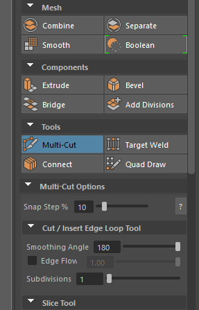

- Hold down **ctrl/cmd** and hover your mouse over the shape, click to add extra edge loops where you think it needs more detail. 

- Press "q" to quit out of the tool.

- Scale these new edge loops as before to improve the shape.

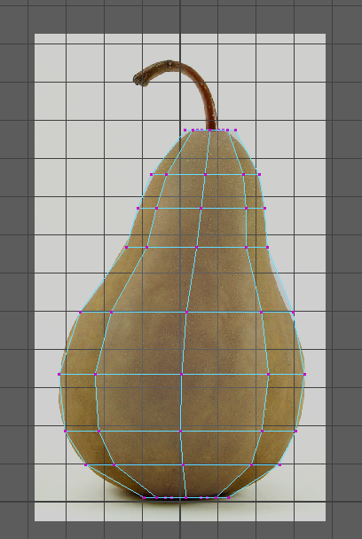

### Smooth 

- Go back into the persp panel by pressing space.

Your pear will look quite angled

- Select the model, and select **Mesh Display > soften edges**

### Final details

- Pull up the top edge loop to create a depression in the top.

- Do the same thing on the bottom.

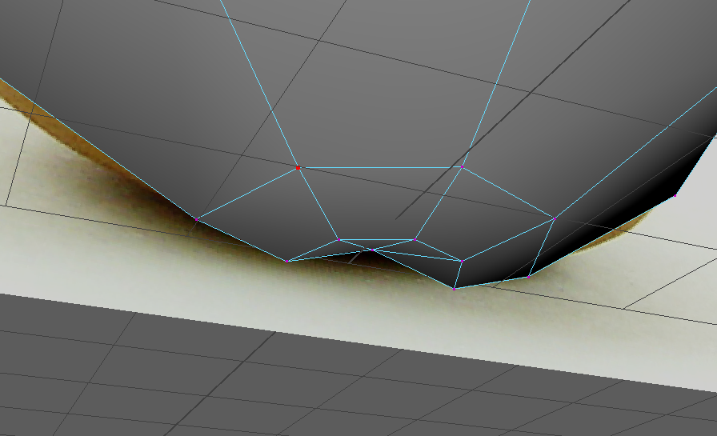

As we are making an organic object, we do not want it to be too perfect. 

- Select individual vertices on the shape and move them slightly to add some imperfections to the surface.

## Challenge

Now that the main body of the pair is complete your challenge is to create the stalk in the same way.

You can make this a separate object or extrude the top faces upwards.

when you scale and move the vertex loops you can also rotate them if needed.

When you have finished, you can hide the reference image by selecting it and pressing "h".

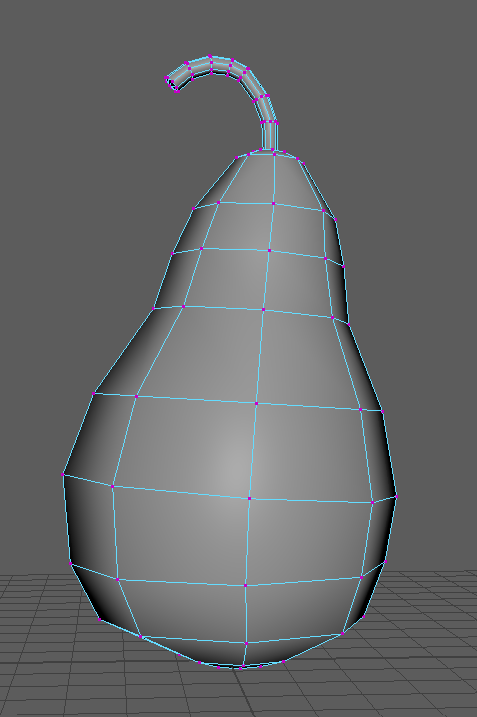

 

