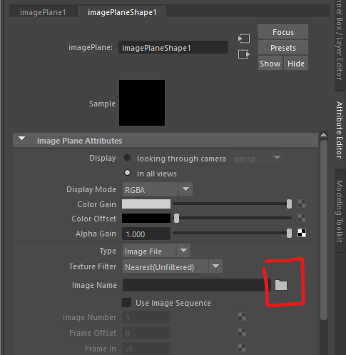
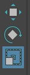

# Worksheet 3 - Organic modeling from a reference Image

### Create a new scene

- Open up Maya
- Create a new Scene

- Create a new folder and save the Maya scene inside it. 

This is important as we are now using multiple files and need to keep them together.

## Model a Pear

In this worksheet we will model from a reference image, we will make a low poly pear, but this technique is very useful for acurately modeling anything from 2D reference images.

### Import reference image

You can work from sketches for your own project, but we will work from a photo.

We will use this image of a pear.

[Pear image](./assets_for_worksheets/pear_reference.jpg)

- Save the image by right clicking it and find the option to save the image.
- Save it in the same folder as your scene.

### Create a reference image plane

In Maya

- In the top menu select **Create > Free image plane**
- With the plane selected open up the **attributes** tab by pressing the button at the top right of the screen.

- Press the folder icon and navigate to your pear image.

- Move the pear image up so that it sits nicely on the grid ( press 'w' or the move button while the image is selected)

### Create a cylinder

- **Double click** on the **create cylinder button**

- Create a cylinder with the following properties:

	- radius 5
	- height 10
	- Axis divisions 8
	- Height divisions 2
	- cap divisions 2

- Move the cylinder up so it is sitting on the grid.

### X-Ray mode

- Go into the side orthographic view by tapping the space bar, then hover over the front-z panel and tapping the space bar again.

You can now enter X-Ray mode so you can see through your cylinder.

- Select **Shading > X-Ray** on the panel menu

### Vertex mode

- Go into Vertex selection mode. You can do this through the Modeling toolkit.

Or, if you want to work more quickly you can hold down the right mouse button, then move it and let go over the vertex button.

### Scale the edge loops

We can now scale down the vertices to match the shape of our pear reference.

- Select a whole row of vertexes by drawing a rectangle around them

- Go into scale mode by pressing **r** or the scale button

- Click and drag the middle yellow square to evenly scale the loop in all directions.

*Do not use the right hand red square, as it will only scale the shape in one dimension*

- With the vertices still selected, go into move mode by pressing "w" or the move button.

- Move the vertexes sideways to match the reference.

- Scale and move all your vertexes to roughly match your reference.

### Check your work

Before we go further we now want to check our model in perspective view to make sure it looks OK.

- Press the space bar, and then hover over the perspective panel and press it again to go back into perspective view.

- Check that the shape is even and you have not accidently squashed it in one dimension.

### Add extra detail

- Go back into the front view again by pressing the space bar

We can now add extra edge loops to improve the model.

- Select the multi-cut tool using the toolkit button or **ctrl + shift + x**

- Hold down **ctrl** and hover your mouse over the shape, click to add a few extra edge loops where you think it needs more detail, dont add too many. 

- Press "q" to quit out of the tool.

- Scale these new edge loops as before to improve the shape.

### Smooth 

- Go back into the persp panel by tapping space, and again over the persp panel.

Your pear will look quite faceted, with hard corners, you may like this low poly look or you can soften the edges to make it appear rounder.

- Select the model, and select **Mesh Display > soften edges**

### Top and bottom

- Pull up the top edge loop to create a depression in the top.

- Do the same thing on the bottom.

As we are making an organic object, we do not want it to be too perfect. 

- Select individual vertices on the shape and move them slightly to add some imperfections to the surface.

### Stalk

We can now move onto the stalk, modeling it as a separate object.

To make this we will first create a curve, then extrude a polygon following the path.

- Go back into the front view

#### Curves

Select the "EP curve" tool in the Curves tab.

- Starting from the end of the stalk, **left click** to create the curve. hold down the mouse button to adjust the curve.

#### Polygon

**Double click** to make a polygon disk.

- Set the options as bellow and press create.

- Move and rotate the disk to place it on the end of the curve

#### Extrude

- Now go into face mode and select all the faces on the disk

- In the **Outliner** hold **ctrl** and **left click** the curve

The disk and curve should now be selected

- On the top menu, select **Edit Mesh** > **Extrude

Now we need to add some divisions

- Increase the divisions to 6

If you like, you can now scale and adjust edges and vertices on the stalk to make it look more natural.

## Hide

When you have finished, you can hide the reference image by selecting it and pressing "h" (select it the outliner and press "h" to show it again).

Save you work.

