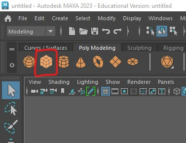
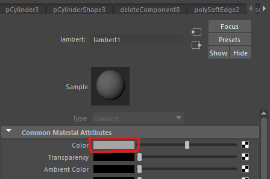
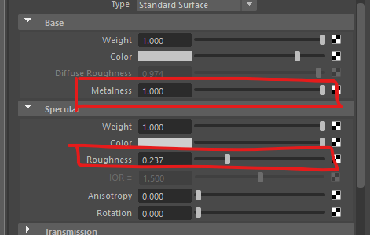
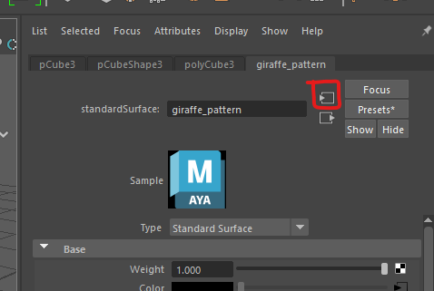
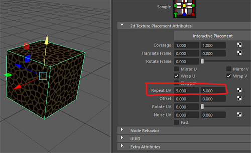

# Worksheet 3 - Textures

### Before you start

All the machines in the lab have Maya installed, if you want you use your own machine follow the installation guide.

[Maya instalation guide](https://www.uwe.ac.uk/study/it-services/software/specialist-software#autodesk_maya)

It is essential that you have a mouse.

## Add colour

### Create a new scene

- Open up Maya
- Create a new Scene

- Save the scene in the principles of 3d folder you created in workshop 1, or somewhere equally sensible.

### Add a polygon

- Create a polygon cube

### Add a material

- Select you cube, **hold down the right mouse button** and select  **Assign New Material...**

	
- Select **Maya > Standard Surface**

The Attribute editor will now appear.

If you loose your attribute editor panel, you can get it back by first making sure your object is selected, and then holding down the right mouse button and selecting **Material Attributes**

- Change the name to "cube material 1" and press enter. It is really important to name materials to avoid confusion later on.

- Change the colour of the material by double clicking on the box next to **Color**

- The cube in your scene should now have the colour, if it doesn't make sure the **textured** button is turned on in the viewport

- Experiment with the **Roughness** and **Metallic** sliders to see how they change the look of the cube.

## Adding an image map

- Create another cube, move it next to the first and assign a new **Standard Surface** material just like we did above.
- This time, name it "giraffe_skin_material"
- Instead of a colour, we want to use an image.
- Download the giraffe print image 

[Giraffe texture](./assets_for_worksheets/giraffe.jpg)

- Save it in the same folder as your scene. this is really important as the image will be loaded in each time you open Maya. 
- Click the black and white button next to Color 

- Choose file

	
- Click on the folder icon and find the giraffe pattern you downloaded earlier.

- You should now see the pattern applied to your cube

## Change the scale

To scale the pattern, press this button

- and then the place2dTexture tab

- Then changing the Repeat UV values, it is a good idea to keep them the same to avoid stretching the texture.

## UV mapping

Do not do any UV mapping until you have finished modeling or you will need to do it again.

### Import model

- Download the cactus fbx file

[cactus fbx file](./assets_for_worksheets/cactus.fbx)

- Import the model into Maya by choosing **File > import**

- Move the model so it is not on top of the cubes

- Select the cactus and apply the giraffe skin texture by right clicking and choosing **Assign Existing Material** > **giraffe_skin_material**

- You should now see the material on the cactus, but it may look distorted and stretched. This is because it has not been UV mapped.

- The easiest solution to this is to use automatic mapping.
- With the cactus still selected, select **UV > Automatic** from the top menu

- This should do a good job at UV mapping the cactus for you

## Create your own texture

We are now going to export the uv's and open them up in Photoshop and create our own textures.

### UV Editor

- With your cactus selected, choose **UV** > **UV Editor** from the top menu

This will open up the editor allowing you to see how automatic mapping has laid out your UV's.
- You can select faces in the UV editor and see their corresponding face the perspective view

	
In this image you can see where the front of the cactus is.

### Create a snapshot

- In the uv editor, use the mouse to select all the uv's by drawing a square around them.

- Now Take a snapshot of the uvs by pressing the camera icon at the top of the editor.

- Save the snapshot somewhere sensible on your machine. make sure it is set to png and the edge colour is black.

	
### Open the snapshot in Photoshop

- Open PhotoShop on your machine
- Use PhotoShop to open the snapshot you just created.

Layer 1 is your snapshot.
	
- Create 3 new layers by clicking the plus button at the bottom right of the screen.

- Layer 2 is going to be our background, click on it to select it

	
- Choose a green fill colour by double clicking the little black square at the bottom left of the screen and choosing a green colour.

	
- Press **alt and delete** on the keyboard fill the layer with green.

- Click and drag layer 1 so that it appears above layer 2 in the list. 

### Add a face

- Download one of the following face image

[face image 1](./assets_for_worksheets/face_1.png)

[face image 2](./assets_for_worksheets/face_2.png)

[face image 3](./assets_for_worksheets/face_3.png)

[face image 4](./assets_for_worksheets/face_4.png)

[face image 5](./assets_for_worksheets/face_5.png)

- Click on layer 3 in PhotoShop to select it.
- Drag the face image file into PhotoShop and drop it in the middle of the screen
- Drag and scale it so that is in the right position on the snapshot.

	
- We want to hide the initial snapshot image before we export, so press the eye icon next to layer 1 to hide it.

- Export the image by selecting **File > Export > Quick Export as PNG** and save it in your principles of 3d folder. name it "cactus_with_face"

### Apply the next texture to your Cactus

- Go back into Maya
- Close the uv editor panel if it is still open
- Select your cactus
- Hold down the right mouse button and select **Assign new material**

- Select **Maya > Standard Surface** as before
- Add the colour map you just created

### Look at your applied texture

- Your finished cactus should look something like this

