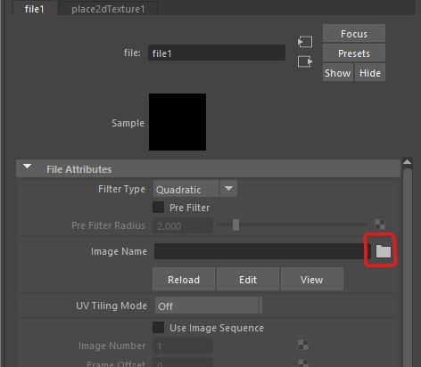

# Worksheet 4 - Textures

## Add colour

### Create a new scene

- Open up Maya
- Create a new Scene

- Save the scene in a new folder, This is particularly important as we will be adding separate texture files which Maya will not find if you move them later.

### Add a polygon

- Create a polygon cube

### Add a material

With the cube selected

- In the **Rendering** tab, select **Standard Surface Material**

The Attribute editor should open on the right of the screen showing the **StandardSurface2** tab open.

NOTE : You can see the material on any object by selecting it, then holding down the right mouse button and selecting **Material Attributes**

#### Change the name

- Change the name to "cube material 1" and press **enter**. It is really important to name materials to avoid confusion later on when you have multiple materials.

- Change the colour of the material by double clicking on the box next to **Color**

- Press **Done** and Your cube should now appear as that colour.

- There are lots of options to adjust the material, you can adjust the metalness and roughness but the full effect will only become clear when we move on to lighting and rendering next week.

You can apply different materials to different faces.

- Select some faces and apply apply a new standard surface material.

### Adding an image map

- Create another cube, move it next to the first and assign a new **StandardSurface** material just like we did above.
- This time, name it "giraffe_skin_material"
- Instead of a colour, we want to use an image.
- Download the giraffe print image 

[Giraffe texture](./assets_for_worksheets/giraffe.jpg)

- Save it in the same folder as your scene. this is really important as the image will be loaded in each time you open Maya. 
- Click the black and white button next to Color 

- Choose file

	
- Click on the folder icon and find the giraffe pattern you downloaded earlier.

- Check the **textured** icon at the top of the panel is active.

- You should now see the pattern applied to your cube

### Change the scale

We now want to scale the pattern

- go back to the material attributes by **right clicking** on the cube and selecting **Material attributes**

press the image arrow next to the colour

- Then the place2dTexture tab

- Then changing the Repeat UV values, it is a good idea to keep them the same to avoid stretching the texture.

### Import a model

We are now going to apply a texture to more complex object.

- Download the cactus fbx file

[cactus fbx file](./assets_for_worksheets/cactus.fbx)

- Import the model into Maya by choosing **File > import**

- Move the model so it is not on top of the cubes.

## Prepare the model

To apply an image texture to a more complicated object we first need to prepare the model so that the textures appear correctly.

Part of this process is UV mapping which we will do shortly, but before this we need to clean it up.

### Delete history

The history keeps track of changes you make to your model but can make your outliner and uv mapping more complicated.

**- Important -** If you are working on your own model, save a copy before you delete the history so that you can go back if you need to.

- Delete the history of the cactus by selecting the pot and cactus and pressing the **Delete history** button in the Poly Modeling tab

### Freeze transforms

When making your model you may have scaled some of the pieces. Before uv mapping, the scales all need to be reset to 1. To do this select the cactus and press the **Freeze transforms** button.

### Apply a material

- Select the cactus and apply the giraffe skin texture by right clicking and choosing **Assign Existing Material** > **giraffe_skin_material**

You should now see the material on the cactus, but it may look distorted and stretched. This is because it has not been UV mapped.

## UV mapping

UV mapping should be done after you have completely finished modeling. If you make any changes to your mesh you may need to re-map all or part of your model.

The easiest solution to this is to use automatic mapping.
- With the cactus still selected, select **UV > Automatic** from the top menu

This should do a reasonable job at UV mapping the cactus for you

### UV Editor

- With your cactus selected, choose **UV** > **UV Editor** from the top menu

This will open up the editor allowing you to see how automatic mapping has laid out your UV's.

- You can select uv faces in the UV editor and see their corresponding polygon face in the perspective view

	
In this image you can see where the front of the cactus has been mapped to.

### Editing UV shells

Automatic mapping splits the surface of the model into different uv shells. It does a reasonable job,  however, it is not very smart and can splits the model into more uv shells than necessary. 

If you have a seamless texture you will see joints in the texture between shells.

You cannot avoid joints entirely, however, if you manually uv map your model you have more control to hide the joint.

- If you would like to manually map your own model, please watch my UV mapping video on Blackboard (learning materials > Maya content >  extra videos)

For this worksheet we will continue with what the automatic mapping has given us.

## Create your own texture

We are now going to export the UV's and open them up in PhotoShop and create our own textures.

### Create a snapshot

Each piece is called a UV Shell.

- In the **UV editor** Press the **UV Shell Selection** button in on the right.

- Use the mouse to select all the uv shells by drawing a square around them.

- Now Take a snapshot of the UV's by pressing the camera icon at the top of the editor.

- Save the snapshot to the same folder as your scene. make sure it is set to png and the edge colour is black.

### Open the snapshot in PhotoShop

- Open PhotoShop on your machine
- Use PhotoShop to open the snapshot you just created.

Layer 1 is your snapshot.
	
- Create 3 new layers by clicking the plus button at the bottom right of the screen.

- Layer 2 is going to be our background, click on it to select it

	
- Choose a green fill colour by double clicking the little black square at the bottom left of the screen and choosing a green colour.

	
- Press **alt and delete** on the keyboard fill the layer with green.

- Click and drag layer 1 so that it appears above layer 2 in the list. 

### Add a face

- Download one of the following face image

[face image 1](./assets_for_worksheets/face_1.png)

[face image 2](./assets_for_worksheets/face_2.png)

[face image 3](./assets_for_worksheets/face_3.png)

[face image 4](./assets_for_worksheets/face_4.png)

[face image 5](./assets_for_worksheets/face_5.png)

- Click on layer 3 in PhotoShop to select it.
- Drag the face image file into PhotoShop and drop it in the middle of the screen
- Drag and scale it so that is in the right position on the snapshot.

	
- We want to hide the initial snapshot image before we export, so press the eye icon next to layer 1 to hide it.

- Export the image by selecting **File > Export > Quick Export as PNG** and save it in your principles of 3d folder. name it "cactus_with_face"

### Apply the new texture to your Cactus

- Go back into Maya
- Close the UV editor panel if it is still open
- Select your cactus
- Assign a new **standard surface material** as you did before.

- rename the material

- Add the colour map the same way as you added the giraffe texture. (file)

### Look at your applied texture

- Your finished cactus should look something like this

## Extra Challenges

- Find a seamless stone texture online and apply it to the cactus pot.

A good source of free textures is [ambientcy.com](https://ambientcg.com/)
- Texture your pear or robot from the previous worksheets.

## Final Challenge

- Watch the manual UV mapping video on Blackboard and try to manually map the cactus and reapply the texture.

