# Worksheet 5 - Organic modeling from a reference

### Before you start

All the machines in the lab have Maya installed, if you want you use your own machine follow the installation guide.

[Maya installation guide](https://www.uwe.ac.uk/study/it-services/software/specialist-software#autodesk_maya)

Make sure you have a mouse.

### Create a new scene

- Open up Maya
- Create a new Scene

- Save the scene to a new folder.

### Import fbx file

- Import this cup fbx file into Maya

[metal_cup for rendering](./assets_for_worksheets/tropy_for_rendering.fbx)

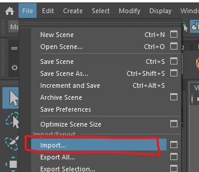

- Turn on Textures

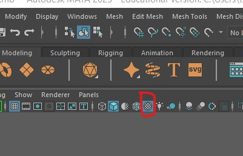
	
- You should now be able to see the textured model

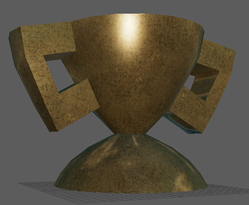
	
### Test Render

- To render the scene press the **render current frame** button at the top middle of the screen

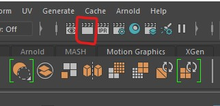

- This will open the **Render View** you will see that it is completely black. This is because you have no lights in your scene.

- Close the Render View Window.

### Add Lights

- On the menu bar, select **Create > Lights > Directional Light**

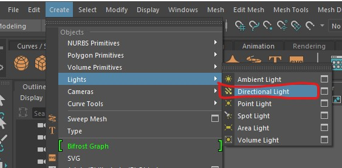
	
- Move the light up above the model and rotate it so that the arrows point toward the model.

- Only the rotation has an effect, the directional light is normally used to simulate a distant light source such as the Sun.

### Turn on Lights in scene

- You can get an approximation of what the light will look like in the final render by turning on lights in the scene

- You can do this in the panel menu

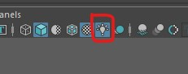

### light properties

- With the light selected you can change the attributes.

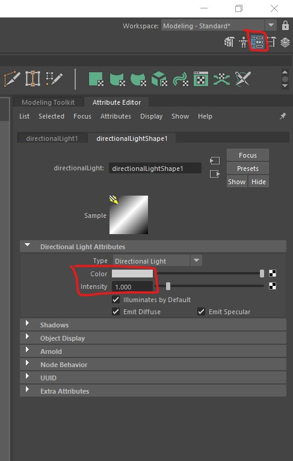
	
- If you cannot see the attributes, click on the attributes button in the top right of the screen.

- Experiment with the colour and intensity.

### Render the scene

- Try to render the scene again, this time you should see something.

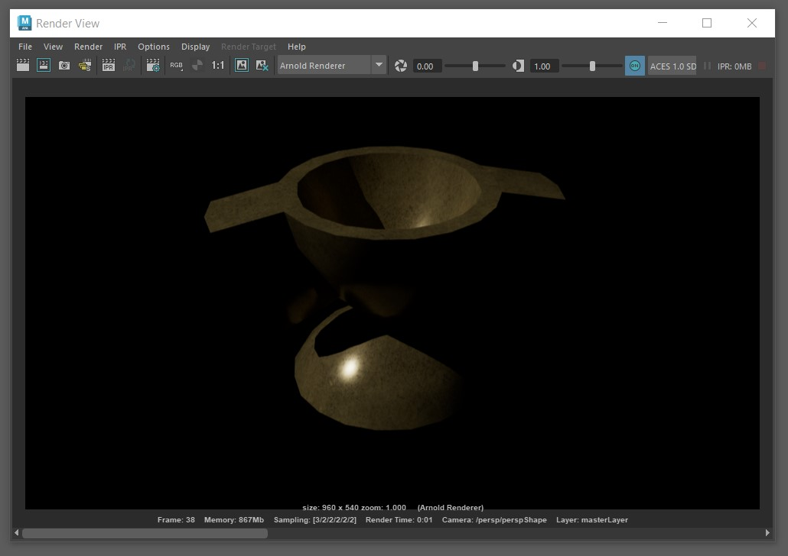
	
### Add more lights

- Add a point light
- Move it above the model
- You may find you need to increase the intensity to see an effect. You can type a number into the box, start with 1000 if you cannot see anything.

- Add a spot light
- These lights have many more attributes.
- Experiment with the **Cone angle** and **Penumbra**

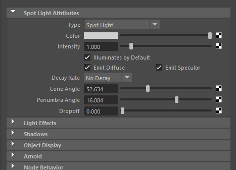

## Rendering

 - With the render view open, you can export your current render by selecting **File > Save Image...**
 
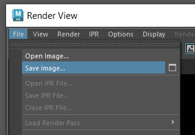
	
- Choose a location and change the file type to png.

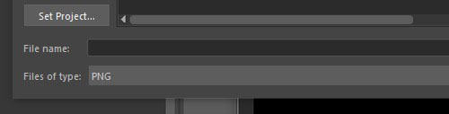
	