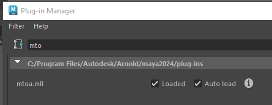
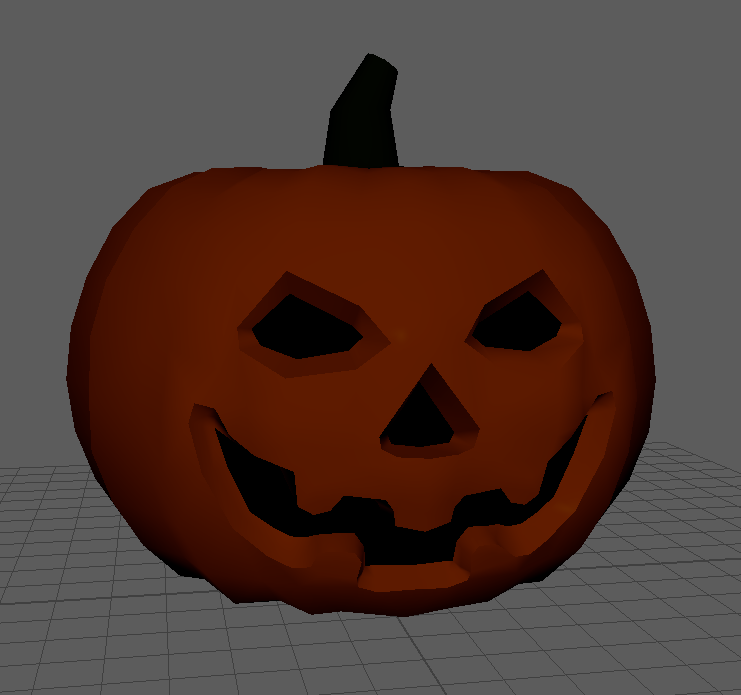
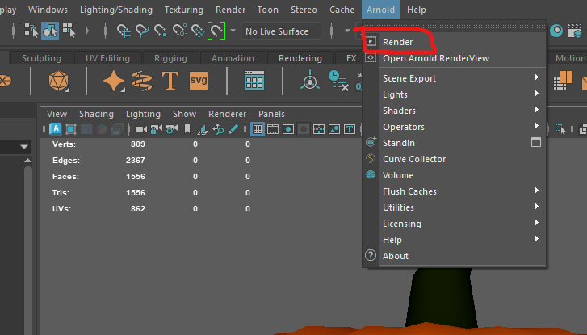
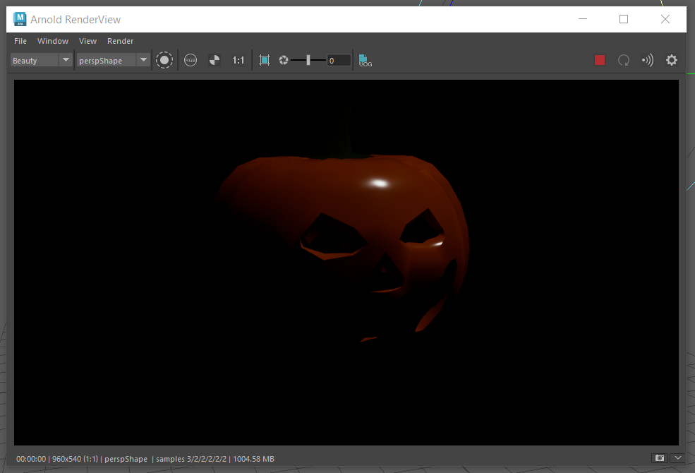
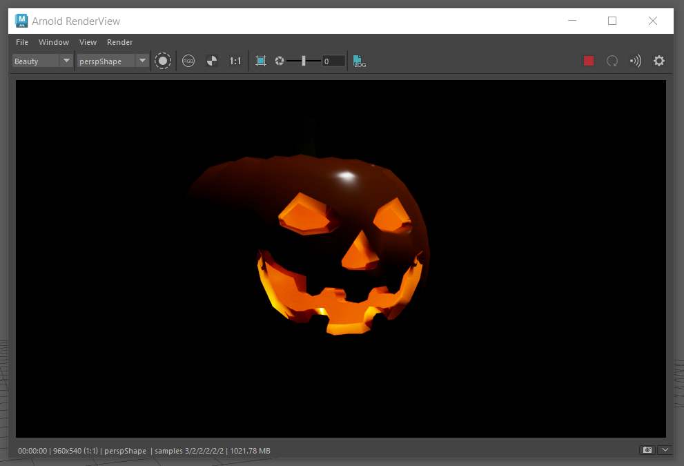
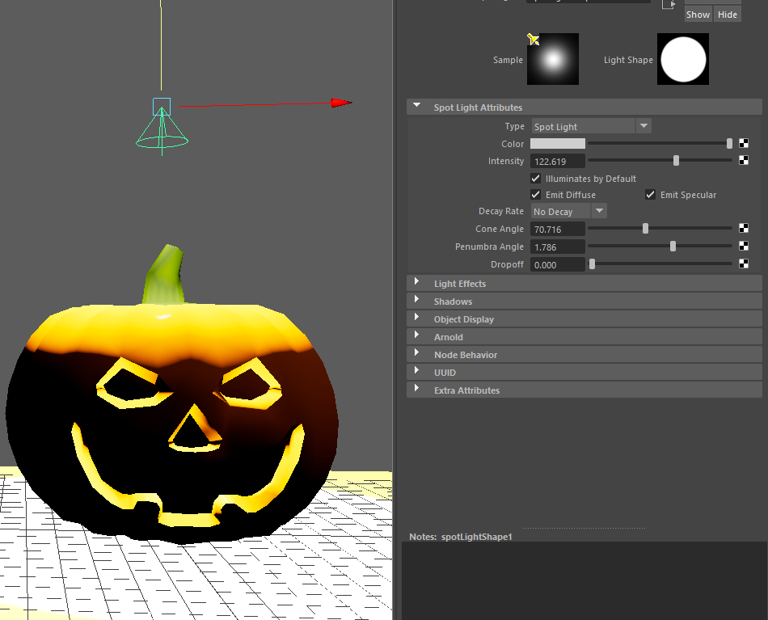
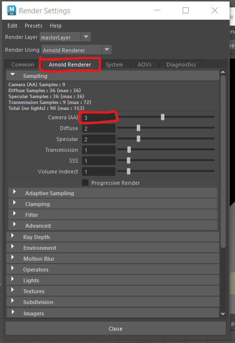

# Worksheet 5 - Lighting and rendering

## Arnold Renderer

We will be using the Arnold Renderer in this worksheet.

If you are using the lab machines the Arnold render will already be installed and you can skip ahead to "Create a new scene"

If you are on your own machine, you will have been given the option to install it when you installed Maya. If you have it you should see an Arnold menu item.

 

If you cannot see it, you may need to install it separately from here:

https://www.arnoldrenderer.com/download/

You can then turn on the Arnold render by going to

**Windows > Settings/Preferences > Plug-in manager**

Then tick the boxes next to mtoa.mll

### Create a new scene

- Open up Maya
- Create a new Scene

- Save the scene to a new folder.

### Import fbx file

- Import this pumpkin fbx file into Maya

[pumpkin for rendering](./assets_for_worksheets/pumpkin.fbx)

	
- You should now be able to see an orange pumpkin model in your scene.

	
### Test Render

- To render the scene select **Arnold > Render**

- This will open the **Render View** you will see that it is completely black. Why is this?

- It is because you have no lights in your scene.

- Close the Render View Window.

### Add Basic Lights

- On the menu bar, select **Create > Lights > Directional Light**

	
- The light will be created at the origin, so move the light up above the model and rotate it so that the arrows point toward the model.

- Only the rotation has an effect on directional lights, they are normally used to simulate a distant light source such as the Sun.

### Turn on Lights in scene

- You can get an rough approximation of what the light will look like in the final render by turning on lights in the scene.

- You can do this in the panel menu

### light properties

- With the directional light selected you can change the attributes.

	
- If you cannot see the attributes, click on the attributes button in the top right of the screen.

- Experiment with the changing the colour and intensity.

### Render the scene

- Try to render the scene again, this time you should see something.

You should see that this renders the view from your camera.
	
### Point lights

- Add a point light

- Move it inside the model

Increase the intensity to get a nice glow inside the pumpkin. You can type a number into the box, start with 200 if you cannot see anything.

### Spot light

- Add a spot light

- Move it above the pumpkin and rotate it so that the cone point downwards

These lights have many more attributes.
- Experiment with the **Cone angle** and **Penumbra**

You may want to add a polygon plane under your pumpkin so that you can see how the lights cast shadows on other objects.

- Render your scene to see how it looks.

## Render Settings

- Open the render settings by clicking the **render settings** button.

- In the **common** tab, make sure you are rendering using the Arnold Renderer and change the Image format to **jpg**.

- Next, scroll down and change the Image size Preset to **hd_1080** This will mean your renders are full hd (1920 x 1080 pixels)

- Render your scene again and see how it looks.

## Saving your render

 - With the render view open, you can export your current render by selecting **File > Save Image...**

	
- Choose a location and a file name and save the image.

## Render Quality

You may find that your render quality is not very good. This can happen if you have low lighting or lots of complex objects in your scene.

You can adjust the render quality in the **render settings** panel.

- Open the render settings panel

- In the Arnold tab you can increase the number of samples. Start by slowly increasing the **AA** samples.

Be careful, increasing the samples will improve your render quality but the the render time will increase exponentially.

More information about these settings can be found here:

https://help.autodesk.com/view/ARNOL/ENU/?guid=arnold_user_guide_ac_render_settings_ac_samples_html

