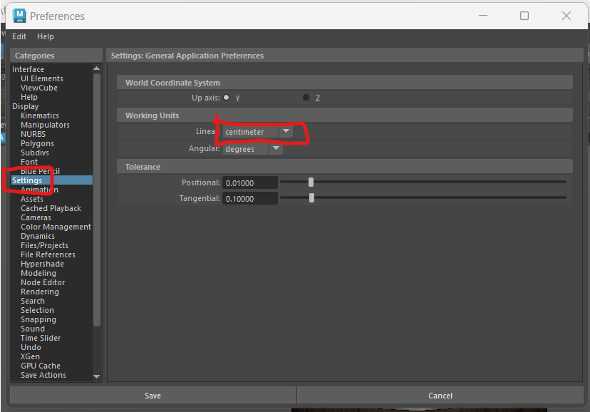
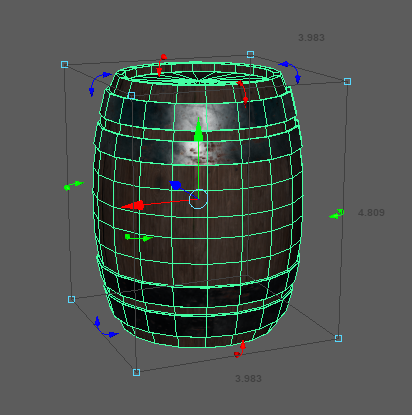
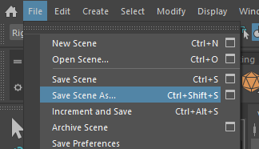
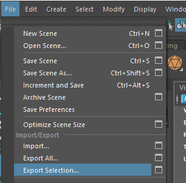
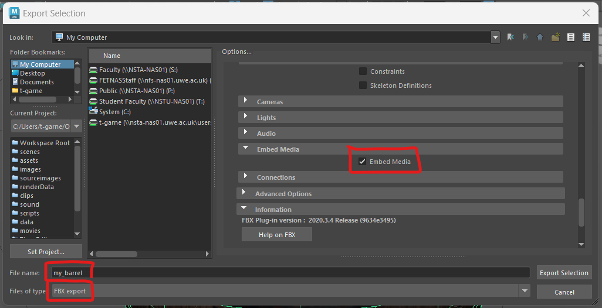
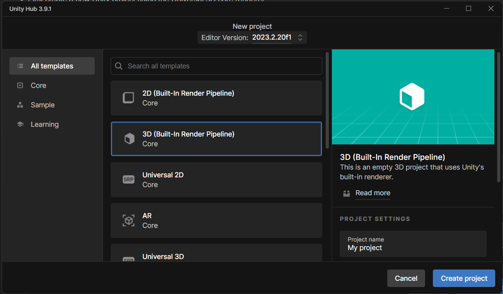

# Exporting from Maya

## Open your object

- If you already have a textured model, open that in Maya.

or

- Create a new maya project and download and import the barrel fbx file using **file > import**

[barrel.fbx](./assets_for_worksheets/barrel.fbx)

## Materials

The Barrel uses Mayas PBR **StingRay Textures** because they are easy to apply in Maya and work   well with Unity.

Other types of Maya textures will work in Unity, but may need re-applying using the second method shown in this worksheet.

For more information about texturing, look back at the previous Maya worksheets or ask.

## Scale

By default 1 unit in Maya is 1 centimetre. This means that if you make a cube 1 unit high and import it into Unity it will be 1cm high. 

However, it is important to check this so that you export it at the correct size.

- Go to **Windows > Settings/Preferences > Preferences**

- Click on **Settings** and take a note of the linear working units. Mine are in cm.

The easiest way to see the actual size of your object is to use the **universal Manipulator**.

- Select your object and press **Crtl + t**

You can see that my barrel is only 4.8cm tall.

- Scale up the barrel to a more appropriate height for a real barrel.

- Make sure the base of the barrel stays on the ground.

## Save a fresh copy

In the next few steps we will be making some changes which may make it harder to edit later. We therefore want to save a new copy of our file so we can go back to the original if we need to. 

- Save your project with a different name.

### Delete history

The history keeps track of changes you make to your model but it can make your file bloated and unstable. Delete it by selecting your model and pressing the **Delete history** button.

### Freeze transforms

When making your model you may have scaled some of the pieces. Before exporting the scales all need to be reset.

- With the barrel selected, press the **Freeze transforms** button.

## Export as FBX

If we want to import our model into a different program the best format to choose is the universal **FBX** file type.

First make sure you have named and organised everything in your outliner. Our barrel is only one object, but if your object is made from multiple parts, group them together using **ctrl + g** and rename the group.

- Select the barrel in the outliner.

- From the top menu, choose **File > Export Selection**

- Choose a sensible location and file name.
- Change the **files of type:** to **FBX export**

- To make sure your textures are included, In the options panel on the right, under **File Type Specific Options** > **Include** tick **Embed Media**

- Finally press the **Export Selection** button.

You have now successfully exported your model from Maya.

## Import into Unity

- Open a Unity project or create a new one using the Universal 3D core renderer.

- Import your model by dragging and dropping the .fbx file onto your **Assets** panel, or going to **Assets > import new Asset**

If you look closely at the barrel you will see that its grey, no textures are applied to it,

However, because we embedded the materials within Maya we can now extract them.

- First create a new folder in your assets panel named "Materials"

- With the barrel selected, go to the Materials tab in the inspector.

- Press **Extract Textures** and choose the new Materials folder when asked.

You may get a pop up asking you to mark some textures as normal maps, they are.

- Press **Fix now**

- Extract the Materials in the same way, you can make a new folder for these or put them in the existing Materials folder.

You can now Drag your barrel into the scene and all the textures should be in place. 

As we have also extracted the materials, we can edit these in Unity if we need to adjust them.

## Re-applying textures

The above barrel should have imported fairly easily, but often the materials wont import properly and need to be re-applied. This can happen with models created with textures Unity does not recognise or if you download models with separate textures.

I have downloaded a model of a dog from Sketchfab ([https://skfb.ly/MnrW](https://skfb.ly/MnrW))

If you don't want to log in to sketchfab you can download it here:

[dog zip file](./assets_for_worksheets/k9-doctors-who-dog.zip)

If you unzip it you can see that the textures come through separately from the fbx file.

- Import the fbx and textures into a new folder in Unity

- Select the dog (K9) model and extract the materials to the same folder as you did before.

You will now have a grey material without any textures on it. 

To apply the textures you need to drag and drop them onto the correct slots in the material.

- With the K9 material selected, drag and drop the **K9-diff** texture into the albedo slot. this is the diffuse map, some assets may call it "colour".

- Try to find the correct slots for the other textures. 

AO stands for Ambient occlusion, this shows how exposed each part of the model is to ambient light. It should go into the Occlusion slot.

Quite often you will get 2 normal maps, directx and Open GL, Unity is usually setup for opengl, however, try both and choose the one you prefer, make sure you press the "fix" button so Unity knows its a normal map.

You may find that you cannot use all the maps.

