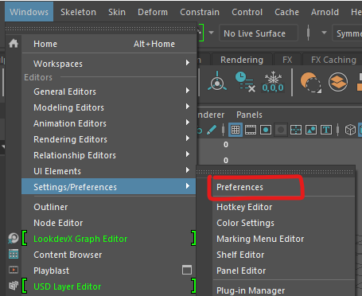

# Worksheet 5 - More modeling

### Before you start

All the machines in the lab have Maya installed, if you want you use your own machine follow the installation guide.

[Maya instalation guide](https://www.uwe.ac.uk/study/it-services/software/specialist-software#autodesk_maya)

Make sure you have a mouse.

### Create a new scene

- Open up Maya
- Create a new Scene

- Save the scene 

### Scale

By default 1 unit in Maya is 1 centimetre. This means that if you make a cube 1 high and import it into Unity it will be 1cm high.

If you are making large objects, building or vehicles it can be useful to change the units to meters.

- Go to **Windows > Settings/Preferences > Preferences**

- Click on **Settings** and change the Linear Working Units to **meter**
- Press Save.

### Exporting for Unity

Before We export our model we need to do a few things to make sure it will import easily into Unity.

#### Save a fresh copy

First save your scene under a new name, this is because we will be making some changes that you you don't want if you need to edit your model later.

#### Delete history

The history keeps track of changes you make to your model but it can make your file bloated. Delete it by selecting your model and pressing the **Delete history** button.

#### Freeze transforms

When making your model you may have scaled some of the pieces. Before exporting the scales all need to be reset to 1. To do this press the **Freeze transforms** button.

#### Export as FBX

If we want to import our model into a different program the best format to choose is an **FBX** file.

To export you model:

- First make sure you have named and organised everything in your outliner.
- Select the object you would like to export and select 

- Choose sensible location and file name
- Change the **files of type:** to **FBX export**
- To make sure your textures are included, In the options panel on the right, under **File Type Specific Options** > **Include** tick **Embed Media**
- Finally press the **Export Selection** button.

You can now import the FBX file into Unity.

